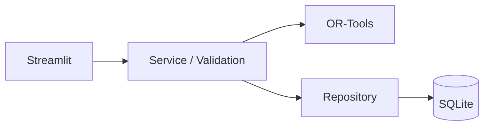

# シフト自動作成デモ

従業員情報、希望休、必要人数などの条件をもとに、
1か月分の勤務シフトを自動生成するWebアプリケーションです。

Google OR-Toolsを利用して複数の制約を考慮し、
生成後の手動調整、再検証、CSV出力まで行えます。

---

## 概要

小規模事業所のシフト作成では、次の条件を同時に考慮する必要があります。

- 従業員ごとの希望休
- 早番・遅番の勤務可否
- 日付・シフトごとの必要人数
- 責任者の必要人数
- 契約勤務日数
- 連続勤務日数

手作業では確認漏れや勤務日数の偏りが起こりやすいため、
本アプリでは入力条件を検証したうえで、月間シフト案を自動生成します。

生成結果はそのまま保存するだけでなく、
画面上で手動変更し、シフト全体を再検証してから確定できます。

---

## 主な機能

- 従業員情報と勤務可能シフトの管理
- 希望休の登録・削除
- 日付・シフトごとの必要人数設定
- OR-Toolsによる月間シフト自動生成
- 生成結果の手動変更と再検証
- 月間表・配置明細・勤務集計のCSV出力

---

## シフト生成で考慮する条件

### 必ず満たす条件

- 1人につき1日1シフト
- 希望休には配置しない
- 勤務可能なシフトだけに配置する
- 必要人数を満たす
- 必要責任者数を満たす
- 1週間の勤務日数を5日以内にする
- 最大連続勤務日数を超えない

### 最適化する内容

- 契約勤務日数と割当勤務日数の差
- 従業員間の勤務日数の偏り

生成前に入力条件を検証し、検出できた問題を画面に表示します。
すべての制約を同時に満たすシフトが存在しない場合は、
生成できなかったことを表示します。

---

## 技術スタック

| 分類         | 技術            |
| ------------ | --------------- |
| 言語         | Python          |
| Web UI       | Streamlit       |
| 最適化       | Google OR-Tools |
| データ処理   | pandas          |
| データベース | SQLite          |
| テスト       | pytest          |

---

## システム構成



画面、業務処理、データアクセスを分離しています。

---

## ディレクトリ構成

```text
shift-scheduler/
├── app.py          # トップ画面
├── pages/          # Streamlit画面
├── src/            # 業務処理・DB・表示変換
├── tests/          # 自動テスト
├── scripts/        # DB確認スクリプト
├── docs/           # 設計・テスト文書
└── requirements.txt
```

---

## 設計上の工夫

- Streamlit画面と業務ロジックを分離
- SQLite操作をRepository層へ集約
- シフト生成前と生成後に制約を検証
- 手動変更後も月間シフト全体を再検証
- 表示用DataFrame変換を画面から分離
- 月間シフトの保存にトランザクションを使用
- CSVをExcel向けのUTF-8 BOM付きで出力

---

## セットアップ

### 1. リポジトリを取得

```bash
git clone https://github.com/rin-sato-tech/shift-scheduler.git
cd shift-scheduler
```

### 2. 仮想環境を作成

```bash
python -m venv .venv
```

macOS・Linux：

```bash
source .venv/bin/activate
```

Windows：

```bash
.venv\Scripts\activate
```

### 3. 依存パッケージをインストール

```bash
python -m pip install --upgrade pip
python -m pip install -r requirements.txt
```

### 4. アプリを起動

```bash
streamlit run app.py
```

データベースと必要なテーブルは、起動時に自動作成されます。

---

## 操作方法

左側のメニューから、次の順番で操作します。

1. 従業員管理で従業員を登録
2. 希望休入力で対象月の希望休を登録
3. 必要人数設定で各日の条件を設定
4. シフト生成で入力検証と自動生成を実行
5. 必要に応じてシフト手動変更で調整
6. CSV出力から各種データをダウンロード

---

## テスト

```bash
python -m pytest -v
```

現在のテスト結果：

- 90件実行
- 90件成功
- 失敗0件

主に次の処理を確認しています。

- 従業員・希望休・必要人数の登録
- 入力データの事前検証
- シフト自動生成
- 生成後の制約判定
- 手動変更と再保存
- トランザクションのロールバック
- CSV変換
- 表示用DataFrame変換
- 一連の操作を確認する統合テスト

DBの整合性確認：

```bash
python scripts/check_db.py
```

詳細：

- [テスト計画書](docs/08_test_plan.md)
- [テスト結果報告書](docs/09_test_report.md)

---

## 現在の制約

本アプリは、単一事業所の月間シフト作成を想定したデモです。

現在は次の機能を対象外としています。

- ログイン・権限管理
- 複数店舗の管理
- 勤務開始・終了時刻の管理
- 週単位の実労働時間計算
- 残業時間の集計
- 勤務間インターバル
- 生成履歴の画面表示
- クラウド上の永続データベース

---

## 今後の改善案

- 生成履歴の一覧・詳細画面
- サンプルデータ投入機能
- 曜日別の必要人数テンプレート
- 早番・遅番以外のシフト種別
- 認証・権限管理
- PostgreSQLなど外部DBへの移行
- CIによる自動テスト

---

## 詳細ドキュメント

### 主要文書

- [プロジェクト概要](docs/01_overview.md)
- [システム設計](docs/03_system_design.md)
- [シフト生成・制約設計](docs/05_schedule_constraints.md)
- [テスト結果](docs/09_test_report.md)

### 仕様・設計の詳細

- [要件定義](docs/02_requirements.md)
- [データ定義](docs/04_data_definition.md)
- [画面設計](docs/06_screen_design.md)

### 利用・品質管理

- [操作ガイド](docs/07_user_guide.md)
- [テスト計画](docs/08_test_plan.md)
- [リリースノート](docs/10_release_note.md)

---

## 開発状況

v1.0.0の主要機能、総合テスト、ドキュメント整備は完了しています。

現在はポートフォリオ公開に向けて、
画面例の追加と最終的な表記確認を進めています。

---

## 利用上の注意

本リポジトリは、学習およびポートフォリオ目的で公開しています。
コードや文書の利用・再配布については、リポジトリ所有者へご確認ください。
