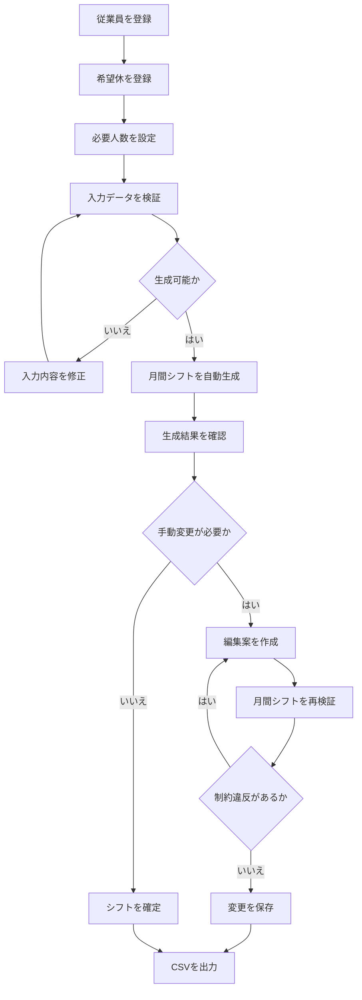

# プロジェクト概要

## 1. 本書の目的

本書は、シフト自動作成デモの背景、目的、対象業務、想定利用者、提供機能を説明する。

アプリの起動方法や技術スタックの概要は`README.md`に記載し、本書では「なぜこのシステムを作成したのか」「どの業務をどのように支援するのか」を中心に整理する。

---

## 2. プロジェクトの背景

月間シフトの作成では、単純に従業員を勤務日に割り当てるだけでなく、複数の条件を同時に考慮する必要がある。

代表的な条件は次のとおりである。

- 従業員ごとの希望休
- 早番・遅番の勤務可否
- 日付・シフトごとの必要人数
- 必要な責任者数
- 従業員ごとの契約勤務日数
- 連続勤務日数
- 1人につき1日1シフトという制限

これらの条件を手作業で確認しながら1か月分のシフトを作成する場合、担当者には大きな負担がかかる。

また、作成結果についても、次のような問題が発生しやすい。

- 希望休への誤配置
- 必要人数の不足
- 責任者の配置漏れ
- 勤務できないシフトへの配置
- 特定の従業員への勤務集中
- 契約勤務日数との大きなずれ
- 修正後の再確認漏れ

シフト作成後に一部を手動で変更した結果、別の制約違反が発生することもある。

本プロジェクトでは、これらの確認と調整をシステム化し、シフト作成担当者の負担軽減と確認漏れの防止を目指す。

---

## 3. システムの目的

本システムの目的は、従業員情報、希望休、必要人数などの入力データを基に、複数の制約を満たす月間シフト案を自動生成することである。

単に自動生成するだけでなく、次の一連の業務を支援する。

1. シフト作成に必要な情報を登録する
2. 入力データに不足や矛盾がないか検証する
3. 条件を満たす月間シフト案を生成する
4. 生成結果を確認する
5. 必要に応じて手動で変更する
6. 変更後のシフトを再検証する
7. 確定結果をCSVとして出力する

自動生成結果をそのまま確定することは前提とせず、人が確認・調整できる仕組みとする。

---

## 4. 想定利用者

本システムでは、小規模な事業所で月間シフトを作成する担当者を想定している。

想定する利用者の例は次のとおりである。

- 店舗や事業所の責任者
- シフト作成担当者
- 現場の管理者
- 少人数組織の業務管理担当者

専門的な最適化知識やSQLの知識がなくても、画面操作だけで利用できることを前提とする。

---

## 5. 想定する利用環境

本バージョンは、学習およびポートフォリオ用のデモシステムであり、次の利用環境を想定する。

- 単一の事業所
- 数名から数十名程度の従業員
- 1か月単位のシフト作成
- 早番と遅番の2種類の勤務シフト
- シフト作成担当者による単独利用
- ローカル環境での実行
- SQLiteによるデータ保存

大規模組織や複数拠点での同時利用は、現在の対象外とする。

---

## 6. 対象業務

本システムが対象とする業務は次のとおりである。

### 6.1 従業員情報の管理

シフト作成に必要な従業員情報を登録・編集する。

管理する情報は次のとおりである。

- 従業員ID
- 氏名
- 責任者区分
- 月間契約勤務日数
- 早番勤務の可否
- 遅番勤務の可否
- 有効・無効状態

退職者や一時的にシフト作成対象から外す従業員は物理削除せず、無効状態として管理する。

### 6.2 希望休の管理

従業員ごとに、対象月の希望休を登録する。

重複した希望休や対象月外の日付が登録されないように検証する。

### 6.3 必要人数の管理

日付・シフトごとに次の人数を設定する。

- 必要人数
- 必要責任者数

月全体へ同じ条件を一括設定した後、日付ごとに個別調整できる。

### 6.4 シフトの自動生成

登録された情報を基に、Google OR-Toolsを使用して月間シフトを生成する。

生成時には、希望休、勤務可否、必要人数、責任者配置、連続勤務日数などを考慮する。

### 6.5 生成結果の確認

生成されたシフトを次の形式で確認する。

- 月間シフト表
- 配置明細
- 従業員別勤務集計
- 制約違反と警告
- 契約勤務日数との差

### 6.6 シフトの手動変更

生成済みシフトを、従業員・日付単位で変更する。

変更内容は編集案として一時保持し、保存前に月間シフト全体を再検証する。

### 6.7 CSV出力

確定済みシフトを次の形式で出力する。

- 月間シフト表
- 配置明細
- 従業員別勤務集計

CSVは、Excelでの日本語文字化けを防ぐためUTF-8 BOM付きで出力する。

---

## 7. 主な機能

本システムは、次の6つの画面機能で構成する。

| 画面           | 主な役割                             |
| -------------- | ------------------------------------ |
| 従業員管理     | 従業員情報の登録・編集・有効状態変更 |
| 希望休入力     | 対象月の希望休の登録・削除           |
| 必要人数設定   | 日付・シフトごとの必要人数設定       |
| シフト生成     | 入力検証と月間シフトの自動生成       |
| シフト手動変更 | 生成結果の変更・再検証・保存         |
| CSV出力        | 月間表、配置明細、勤務集計の出力     |

トップ画面では、これらの画面を利用する順番と、シフト生成で考慮する主な条件を案内する。

---

## 8. 基本的な業務フロー

利用者は、原則として次の順番で操作する。

入力条件に不足や矛盾がある場合は、自動生成を実行せず、問題の内容を画面に表示する。

---

## 9. シフト生成の基本方針

シフト生成では、条件を次の2種類に分けて扱う。

### 9.1 必ず満たす条件

次の条件は、違反を許可しない。

- 1人につき1日1シフト
- 希望休には配置しない
- 勤務可能なシフトにだけ配置する
- 日付・シフトごとの必要人数を満たす
- 必要責任者数を満たす
- 最大連続勤務日数を超えない

これらを満たす組み合わせが存在しない場合、シフトは生成されない。

### 9.2 できるだけ満たす目標

次の内容は、複数の実行可能なシフト案の中から、より望ましい案を選ぶために使用する。

- 契約勤務日数と割当勤務日数の差を小さくする
- 従業員間の勤務日数の偏りを抑える
- 最大の勤務日数差を小さくする
- 全従業員の差の合計を小さくする

シフト生成の詳細は、`05_schedule_constraints.md`に記載する。

---

## 10. システム化によって期待する効果

本システムによって、次の効果を期待する。

### 10.1 確認作業の削減

希望休、勤務可否、必要人数などの条件をシステムが検証することで、目視確認の負担を減らす。

### 10.2 配置漏れの防止

必要人数や必要責任者数を制約として扱い、条件不足を検出する。

### 10.3 シフト作成時間の短縮

組み合わせの検討をOR-Toolsへ任せることで、手作業による配置調整を減らす。

### 10.4 勤務日数の偏りの抑制

契約勤務日数との差を目的関数として扱い、特定の従業員への勤務集中を抑える。

### 10.5 手動変更後の安全性向上

手動変更後も月間シフト全体を再検証することで、修正によって新たな制約違反が発生することを防ぐ。

### 10.6 出力作業の効率化

確定済みデータから、月間表、配置明細、勤務集計をCSVとして出力できる。

---

## 11. 対象外の範囲

現在のバージョンでは、次の機能を対象外とする。

- ログインと認証
- 利用者ごとの権限管理
- 複数店舗・複数事業所の管理
- 複数利用者による同時編集
- 早番・遅番以外のシフト種別
- 勤務開始時刻・終了時刻の管理
- 休憩時間の管理
- 週単位の実労働時間計算
- 残業時間の集計
- 法定休日の厳密な判定
- 勤務間インターバルの管理
- 有給休暇残数の管理
- 給与計算
- 生成履歴の画面表示
- 外部システムとの連携
- クラウド上での永続運用

対象外の機能を明示することで、本バージョンの実装範囲を月間シフト作成の中心機能に限定している。

---

## 12. 使用技術

| 分類           | 技術            | 主な用途                     |
| -------------- | --------------- | ---------------------------- |
| 言語           | Python          | アプリケーション全体         |
| Web UI         | Streamlit       | 画面表示と入力受付           |
| 最適化         | Google OR-Tools | シフト生成                   |
| データ処理     | pandas          | 表示用・出力用データ変換     |
| データベース   | SQLite          | 従業員・希望休・シフトの保存 |
| テスト         | pytest          | 単体・統合テスト             |
| バージョン管理 | Git / GitHub    | ソースコード管理             |

---

## 13. 成果物

本プロジェクトの成果物は次のとおりである。

- Streamlitアプリケーション
- SQLiteデータベース定義
- シフト生成・検証ロジック
- 手動変更・再検証機能
- CSV出力機能
- 自動テスト
- DB整合性確認スクリプト
- 要件・設計・テスト文書

---

## 14. 関連文書

| 文書                         | 内容                   |
| ---------------------------- | ---------------------- |
| `README.md`                  | アプリの概要と起動方法 |
| `01_overview.md`             | 背景、目的、対象業務   |
| `02_requirements.md`         | 機能要件・非機能要件   |
| `03_system_design.md`        | システム構成と設計     |
| `04_data_definition.md`      | DB・Pythonモデルの定義 |
| `05_schedule_constraints.md` | シフト生成と制約       |
| `06_screen_design.md`        | 画面ごとの仕様         |
| `07_user_guide.md`           | 利用者向け操作方法     |
| `08_test_plan.md`            | テスト方針と観点       |
| `09_test_report.md`          | テスト実施結果         |
| `10_release_note.md`         | 公開版の内容           |
