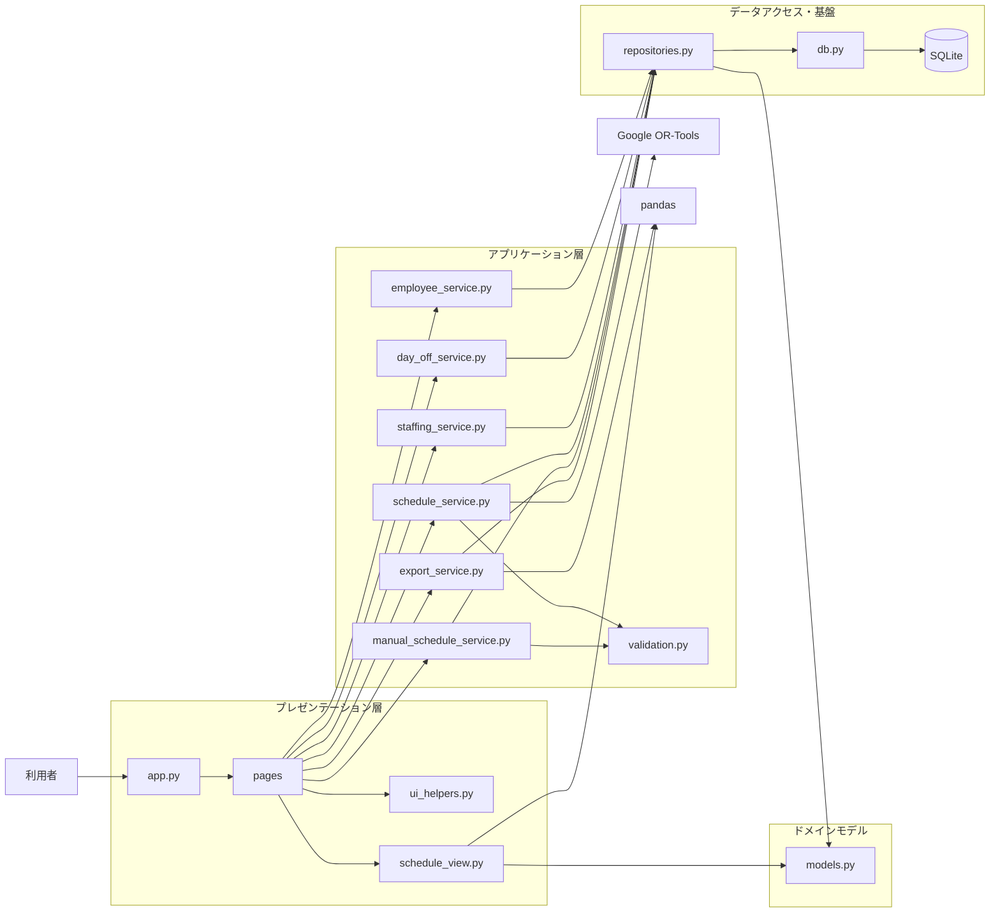
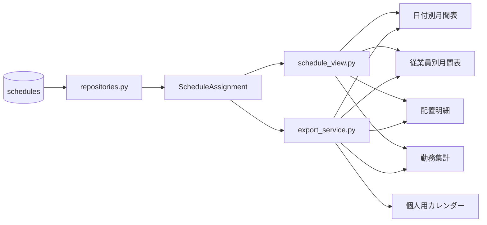
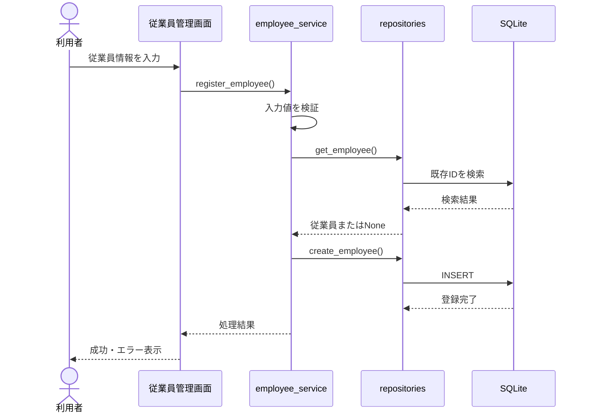
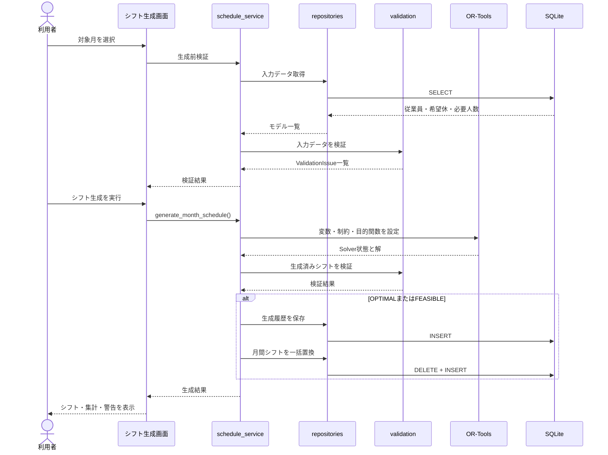
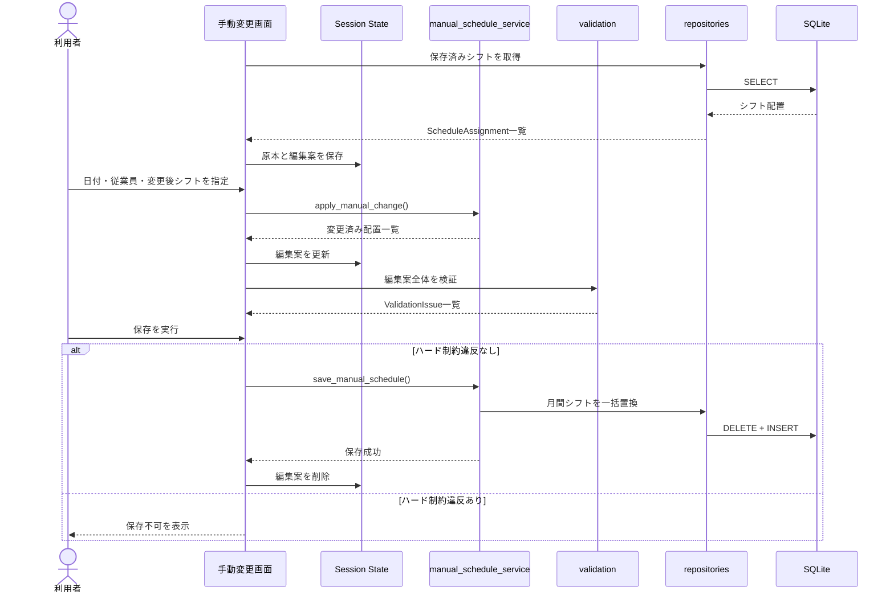
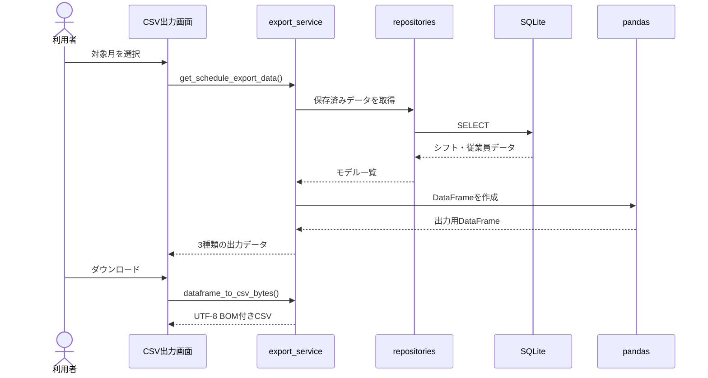
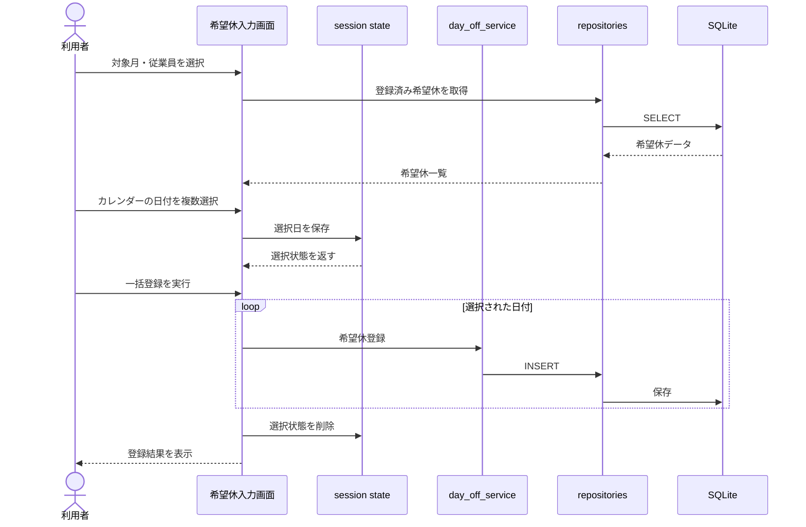
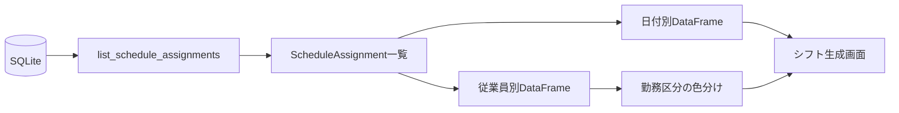
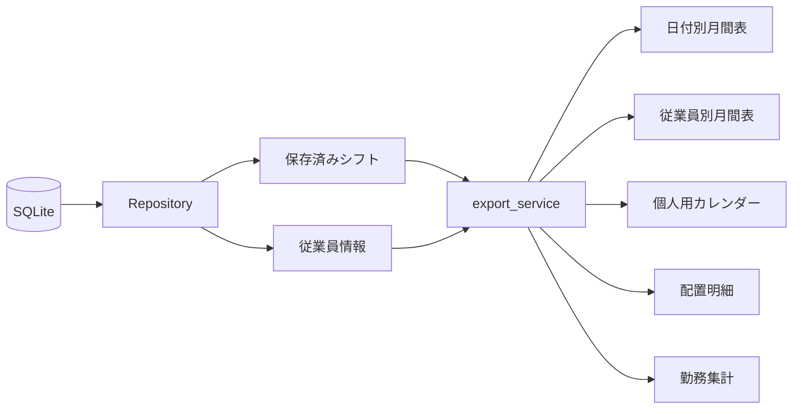

# システム設計

## 1. 本書の目的

本書は、シフト自動作成デモのシステム構成、モジュールの責務、主要な処理フロー、データ保存方法、画面状態の管理方法およびエラー処理方針を説明する。

v1.1.0では、次の設計を追加した。

- 希望休のカレンダー型複数選択
- 日付別・従業員別の月間シフト表示
- 勤務区分の色分け
- 従業員別月間シフト表のCSV出力
- 個人用シフトカレンダーのCSV出力

シフト生成に使用する制約や目的関数の詳細は、`05_schedule_constraints.md`に記載する。

---

## 2. 設計方針

本システムでは、次の方針で設計する。

- 画面表示と業務ロジックを分離する
- SQLをデータアクセス層へ集約する
- 入力検証とシフト生成を分離する
- 自動生成後の手動変更にも同じ制約検証を適用する
- 画面表示用のDataFrame変換をページから分離する
- 表示形式と保存データを分離する
- カレンダーの選択状態をDB保存データと分離する
- 月間シフトの保存はトランザクションで行う
- 共通するUI処理を複数ページで再利用する
- 各処理を自動テストしやすい構造にする

日付別表、従業員別表、個人用カレンダーは、同じ保存済みシフトを異なる形式へ変換した表示・出力データである。

表示形式の切替によって、DB上のシフト配置は変更しない。

---

## 3. システム全体構成



---

## 4. レイヤー構成

本システムは、厳密なフレームワーク上のレイヤードアーキテクチャではないが、責務を次の4領域に分けている。

### 4.1 プレゼンテーション層

対象：

- `app.py`
- `pages/`
- `src/ui_helpers.py`
- `src/schedule_view.py`

主な責務：

- 入力フォームの表示
- 利用者操作の受付
- カレンダーUIの表示
- 複数日選択状態の管理
- サービス処理の呼び出し
- 成功・警告・エラーの表示
- DataFrameの画面表示
- 勤務区分の色分け
- Streamlitセッション状態の管理

希望休カレンダーでは、選択中の日付をsession stateへ保持する。

選択状態は、対象月、従業員、登録・削除の操作種別ごとに分離し、異なる条件の選択が混在しないようにする。

---

### 4.2 アプリケーション層

対象：

- `src/employee_service.py`
- `src/day_off_service.py`
- `src/staffing_service.py`
- `src/schedule_service.py`
- `src/manual_schedule_service.py`
- `src/export_service.py`
- `src/validation.py`

主な責務：

- 入力値の検証
- 業務ルールの適用
- Repositoryの呼び出し
- シフト生成
- 生成結果の検証
- 手動変更案の作成
- 保存可否の判定
- 日付別・従業員別のCSVデータ作成
- 個人用シフトカレンダーの作成
- UTF-8 BOM付きCSVへの変換

### 4.3 ドメインモデル

対象：

- `src/models.py`

主な責務：

- システム内で扱うデータの型定義
- サービス層とRepository層の受け渡し形式の統一
- シフト種別、重大度、Solver状態などの値の制限

モデルには、主に`dataclass`と`Literal`を使用する。

### 4.4 データアクセス・基盤層

対象：

- `src/repositories.py`
- `src/db.py`
- SQLiteデータベース

主な責務：

- DB接続
- テーブル初期化
- SQLの実行
- DBレコードとPythonモデルの相互変換
- 一括登録・一括置換
- トランザクション管理

---

## 5. 主要ディレクトリ

```text
shift-scheduler/
├── app.py
├── pages/
├── src/
├── scripts/
├── tests/
├── docs/
├── data/
├── requirements.txt
├── pytest.ini
└── README.md
```

| パス       | 役割                               |
| ---------- | ---------------------------------- |
| `app.py`   | トップ画面、操作案内               |
| `pages/`   | Streamlitの各機能画面              |
| `src/`     | 業務処理、DB処理、モデル、表示変換 |
| `scripts/` | DB整合性確認などの補助処理         |
| `tests/`   | pytestによる自動テスト             |
| `docs/`    | 要件、設計、操作、テスト文書       |
| `data/`    | SQLiteデータベースの保存先         |

---

## 6. 画面モジュール

### 6.1 `app.py`

トップ画面を表示する。

主な役割：

- DB初期化
- アプリの概要表示
- 操作順の案内
- 主なシフト制約の説明

### 6.2 `pages/1_従業員管理.py`

主な役割：

- 従業員一覧の表示
- 従業員の新規登録
- 従業員情報の編集
- 無効化・再有効化
- 登録結果のメッセージ表示

### 6.3 `pages/2_希望休入力.py`

主な役割：

- 対象月の選択
- 対象従業員の選択
- 月曜日始まりのカレンダー表示
- 希望休登録日の複数選択
- 複数希望休の一括登録
- 登録済み希望休の表示
- 従業員による絞り込み
- 削除対象日の複数選択
- 複数希望休の一括削除
- 登録用・削除用の選択状態管理

カレンダーでは、次の状態を区別する。

- 未選択
- 選択中
- 登録済み
- 対象月外

登録用カレンダーでは登録済み日付を選択できない。

削除用カレンダーでは未登録の日付を選択できない。

#### 希望休カレンダーの状態管理

希望休登録・削除のカレンダー選択状態は、Streamlitのセッション状態で管理する。

状態は少なくとも次の単位で分離する。

```text
対象年月
従業員ID
登録・削除の処理種別
```

この分離により、従業員や対象月を変更した際に、別の条件で選択した日付が混在することを防ぐ。

登録・削除の完了後は、該当する選択状態を削除して再描画する。

### 6.4 `pages/3_必要人数設定.py`

主な役割：

- 対象月の選択
- 月全体への一括設定
- 日付・シフトごとの個別調整
- 必要人数・必要責任者数の保存

### 6.5 `pages/4_シフト生成.py`

主な役割：

- 対象月の選択
- 入力データの事前検証
- OR-Toolsによるシフト生成
- Solver結果の表示
- 日付別月間シフト表の表示
- 従業員別月間シフト表の表示
- 表示形式のタブ切替
- 早番・遅番・休みの色分け
- 手動変更マークの表示
- 配置明細の表示
- 従業員別勤務集計の表示
- 生成後検証の表示

日付別表示と従業員別表示は、同じ`ScheduleAssignment`一覧を異なるDataFrameへ変換して表示する。

手動変更された配置は、`is_manual=True`をもとに`※`を付けて表示する。

従業員別表は、行を従業員、列を日付とし、セルに`早`、`遅`、`休`を表示する。

色だけに依存せず、勤務区分を文字でも表示する。

### 6.6 `pages/5_シフト手動変更.py`

主な役割：

- 保存済みシフトの読込
- 編集案のセッション保持
- 従業員・日付単位の配置変更
- 変更前後の差分表示
- 編集案の再検証
- 編集案の保存・破棄

### 6.7 `pages/6_CSV出力.py`

主な役割：

- 対象月の選択
- 保存済みシフトの読込
- 日付別月間シフト表のプレビュー・出力
- 従業員別月間シフト表のプレビュー・出力
- 個人用シフトカレンダーのプレビュー・出力
- 個人用カレンダーの対象従業員選択
- 配置明細のプレビュー・出力
- 従業員別勤務集計のプレビュー・出力

画面上の背景色、罫線、列幅などはCSVへ含めない。

CSVでは、勤務区分を文字として出力する。

個人用シフトカレンダーは、選択した従業員1名の勤務を月曜日始まりのカレンダー形式へ変換する。

---

## 7. サービスモジュール

### 7.1 `employee_service.py`

従業員管理に関する業務処理を担当する。

主な処理：

- 従業員登録
- 入力値検証
- 重複IDの判定
- 従業員情報の編集
- 有効・無効状態の変更

### 7.2 `day_off_service.py`

希望休に関する業務処理を担当する。

主な処理：

- 1件の希望休登録
- 複数日の希望休登録
- 対象月内の日付かどうかの判定
- 従業員が有効かどうかの確認
- 重複希望休の防止
- 1件の希望休削除
- 複数日の希望休削除

複数選択は画面上の操作であり、各日付の登録・削除では既存の希望休業務ルールを使用する。

### 7.3 `staffing_service.py`

必要人数設定に関する業務処理を担当する。

主な処理：

- 必要人数の検証
- 必要責任者数の検証
- 対象月内の日付かどうかの確認
- 月単位での一括保存

## 7.4 `schedule_service.py`

シフト自動生成の中心となるモジュールである。

主な処理：

- 生成前検証
- 従業員・希望休・必要人数の読込
- OR-Toolsモデルの構築
- Solverの実行
- 生成結果のモデル変換
- 生成後検証
- 生成履歴と月間シフトの保存
- 従業員別勤務集計
- 保存済みシフトの検証

生成履歴はDBへ保存するが、現在の画面では履歴一覧・詳細表示を提供しない。

### 7.5 `manual_schedule_service.py`

手動変更に関する業務処理を担当する。

主な処理：

- 編集案への変更反映
- 早番・遅番・休みへの変更
- 手動変更フラグの設定
- 編集案全体の再検証
- ハード制約違反時の保存拒否
- 月間シフトの一括保存

### 7.6 `export_service.py`

CSV出力に関する処理を担当する。

主な処理：

- 保存済みシフトの読込
- 日付別月間シフト表の作成
- 従業員別月間シフト表の作成
- 個人用シフトカレンダーの作成
- 配置明細の作成
- 従業員別勤務集計の作成
- 手動変更マークの付加
- UTF-8 BOM付きCSVへの変換
- 出力ファイル名の作成

出力形式は次の5種類である。

| 出力                   | ファイル名の例                      |
| ---------------------- | ----------------------------------- |
| 日付別月間シフト表     | `shift_monthly_202608.csv`          |
| 従業員別月間シフト表   | `shift_employee_monthly_202608.csv` |
| 個人用シフトカレンダー | `shift_calendar_E001_202608.csv`    |
| 配置明細               | `shift_detail_202608.csv`           |
| 従業員別勤務集計       | `shift_summary_202608.csv`          |

---

## 8. 共通モジュール

### 8.1 `models.py`

システム内で使用するデータ型を定義する。

主なモデル：

- `Employee`
- `DayOffRequest`
- `StaffingRequirement`
- `ScheduleAssignment`
- `ValidationIssue`
- `EmployeeScheduleSummary`
- `ScheduleGenerationResult`
- `ScheduleGenerationServiceResult`

モデルを画面、サービス、Repositoryで共有することで、辞書やDB行を直接受け渡す処理を減らす。

### 8.2 `validation.py`

制約違反や警告に関する共通処理を定義する。

主な役割：

- エラーの有無の判定
- 生成前の入力検証
- 生成済みシフトの検証で使用する共通処理

検証結果は`ValidationIssue`として返し、画面側で重大度に応じて表示する。

### 8.3 `schedule_view.py`

シフト関連モデルを、画面表示用のDataFrameへ変換する。

主な処理：

- 日付別月間シフト表の作成
- 従業員別月間シフト表の作成
- 早番・遅番・休みの表示値作成
- 手動変更マークの付加
- 従業員別月間表のセル装飾
- 配置明細の作成
- 従業員別勤務集計表の作成
- 手動変更前後の差分表の作成

主な変換関数：

| 関数                              | 役割                               |
| --------------------------------- | ---------------------------------- |
| `build_month_schedule_table()`    | 日付別月間シフト表を作成する       |
| `build_employee_schedule_table()` | 従業員別月間シフト表を作成する     |
| `style_employee_schedule_cell()`  | 勤務区分に応じた表示スタイルを返す |
| `build_assignment_dataframe()`    | 配置明細を作成する                 |
| `build_summary_dataframe()`       | 従業員別勤務集計を作成する         |
| `build_change_dataframe()`        | 手動変更前後の差分を作成する       |

`build_month_schedule_table()`および`build_employee_schedule_table()`では、`show_manual_mark=True`の場合に手動変更済み配置へ`※`を付ける。

色分け処理は、`早※`や`遅※`のように手動変更マークが付いた値も勤務区分として判定する。

従業員別月間シフト表では、配置が存在しない日を表示上の`休`として補完する。

表示用DataFrameの作成と、Streamlitによる色付け・描画は分離する。

### 8.4 `ui_helpers.py`

複数画面で使用するStreamlit処理を共通化する。

主な処理：

- 対象年月の選択
- 検証結果の表示
- 検証メッセージの整形
- Flashメッセージの保存
- 再描画後のFlashメッセージ表示

### 8.5 表示データ変換フロー



画面用とCSV用で元になる配置データは共通とする。

ただし、画面用では色付けや表示幅などのUI処理を行い、CSV用では文字列と表構造だけを出力する。

---

## 9. データアクセス設計

### 9.1 DB接続

`src/db.py`の`get_connection()`を通してSQLiteへ接続する。

接続時には次を行う。

- DB保存先ディレクトリの作成
- `sqlite3.Row`の設定
- 外部キー制約の有効化

DBファイルは、実行時のカレントディレクトリではなく、プロジェクトルートからの絶対パスを基準に決定する。

### 9.2 DB初期化

`init_db()`は、存在しないテーブルだけを作成する。

Streamlitは各ページを直接開けるため、各ページの開始時にも`init_db()`を呼び出す。

### 9.3 Repositoryの役割

`src/repositories.py`に、次の処理を集約する。

- 1件登録
- 1件取得
- 一覧取得
- 更新
- 削除
- 一括登録
- 月単位の取得
- 月間シフトの一括置換

サービス層と画面層では、原則としてSQLを記述しない。

### 9.4 DBレコードの変換

SQLiteから取得した`sqlite3.Row`は、Repository内でPythonモデルへ変換する。

例：

```text
sqlite3.Row
    ↓
_row_to_employee()
    ↓
Employee
```

この方式により、上位層はDB固有の行形式を意識せずに処理できる。

---

## 10. 主要処理フロー

### 10.1 従業員登録



### 10.2 シフト自動生成



### 10.3 手動変更



### 10.4 CSV出力



### 10.5 希望休カレンダー登録フロー



---

### 10.6 シフト表示変換フロー



日付別表示と従業員別表示は、DBから別々のシフトを取得するのではなく、同じ配置一覧から生成する。

---

### 10.7 CSV出力変換フロー



---

## 11. シフト生成設計

シフト生成では、従業員、日付、シフトの組み合わせをOR-Toolsの決定変数として扱う。

概念的には、次の変数を使用する。

```text
x[e, d, s] =
    従業員eを日付dのシフトsへ配置する場合 1
    配置しない場合 0
```

この変数に対して、希望休、勤務可否、必要人数、責任者数、連続勤務日数などの制約を設定する。

目的関数では、契約勤務日数と割当勤務日数との差を抑える。

Solver状態が`OPTIMAL`または`FEASIBLE`の場合のみ、生成結果を保存する。

詳細は`05_schedule_constraints.md`に記載する。

---

## 12. 検証設計

検証は、次の2段階で実施する。

### 12.1 生成前検証

シフトを生成する前に、入力データが生成可能な状態かを確認する。

例：

- 有効従業員が存在するか
- 必要人数設定が揃っているか
- 責任者候補が存在するか
- 必要人数を満たす候補者が存在するか
- 希望休によって配置不能になっていないか

### 12.2 生成後・変更後検証

完成した配置を対象として、制約違反や警告を確認する。

例：

- 同日重複配置
- 希望休への配置
- 勤務不可シフトへの配置
- 必要人数不足
- 責任者不足
- 連続勤務日数超過
- 契約勤務日数との差

検証結果は`ValidationIssue`の一覧として返す。

---

## 13. 検証結果の表現

`ValidationIssue`には次の情報を保持する。

- 重大度
- ルールID
- メッセージ
- 対象日
- シフト種別
- 従業員ID

重大度は次の2種類とする。

| 重大度    | 意味                           |
| --------- | ------------------------------ |
| `error`   | 保存や生成を妨げる制約違反     |
| `warning` | 保存は可能だが確認が必要な状態 |

画面では、エラーと警告を分けて表示する。

---

## 14. 状態管理

Streamlitでは操作のたびにスクリプトが再実行されるため、複数操作にまたがって保持する情報には`st.session_state`を使用する。

### 14.1 手動変更の編集案

対象月ごとに次のデータを保持する。

- 保存済みシフトの原本
- 現在の編集案

キーには対象月を含め、月を変更した際に別の編集案と混在しないようにする。

### 14.2 Flashメッセージ

登録や保存の直後に`st.rerun()`を実行すると、その場で表示したメッセージが消える。

そのため、次回の再描画後に一度だけ表示するメッセージをsession stateへ保存する。

処理の流れ：

```text
処理成功
  ↓
Flashメッセージをsession stateへ保存
  ↓
st.rerun()
  ↓
再描画後にメッセージを表示
  ↓
session stateから削除
```

### 14.3 希望休カレンダーの選択状態

希望休入力画面では、カレンダー上で選択中の日付を`st.session_state`へ保持する。

選択状態は、次の条件ごとに分離する。

- 対象年月
- 従業員ID
- 登録または削除の操作種別

これにより、対象月や従業員を切り替えた際に、別条件で選択した日付が混在することを防止する。

概念的なキーは次のとおりである。

```text
希望休登録｜対象月｜従業員ID
希望休削除｜対象月｜従業員ID
```

選択状態は一時的な画面状態であり、希望休の登録または削除が正常に完了した後に消去する。

登録用と削除用の選択状態は別々に保持する。

---

## 15. トランザクション設計

月間シフトの保存では、既存シフトを削除した後に新しいシフトを登録する。

この2つの処理は、同一のDB接続とトランザクション内で実行する。

```text
トランザクション開始
  ↓
対象月の既存シフトを削除
  ↓
新しいシフトを一括登録
  ↓
コミット
```

途中で例外が発生した場合はロールバックされ、既存シフトが削除されたままになることを防ぐ。

対象月外の配置が含まれる場合は、DB更新前にエラーとする。

---

## 16. エラー処理方針

### 16.1 利用者が修正できるエラー

入力値や業務ルールに関するエラーは、サービス層で検出し、画面へメッセージとして返す。

例：

- 従業員IDの重複
- 氏名が空
- 希望休が対象月外
- 希望休の重複
- 必要責任者数が必要人数を超える
- ハード制約違反を含む編集案

### 16.2 DB制約違反

一意制約や外部キー制約など、DBで発生する例外はサービス層で必要に応じて業務メッセージへ変換する。

### 16.3 予期しないエラー

予期しない例外を無条件に成功扱いにはしない。

データ更新処理ではトランザクションを使用し、途中状態が残らないようにする。

### 16.4 カレンダー操作のエラー

希望休カレンダーでは、次の場合に登録・削除処理を実行しない。

- 従業員が選択されていない
- 日付が1件も選択されていない
- 登録済みの日付を再登録しようとした
- 未登録の日付を削除しようとした
- 対象月外の日付が指定された
- 無効な従業員へ希望休を登録しようとした

入力上の問題は画面上にメッセージとして表示し、利用者が修正できるようにする。

複数日を一括処理する場合も、各日付には既存の希望休登録・削除ルールを適用する。

### 16.5 表示・CSV変換時の扱い

表示用またはCSV出力用のデータ変換では、次の方針とする。

- 対象月のシフトが存在しない場合は、空の表または案内メッセージを表示する
- 従業員情報を取得できない配置では、従業員IDを代替表示する
- 個人用カレンダーで従業員が選択されていない場合は、CSVを出力しない
- 対象月外のカレンダーセルは空欄として扱う
- 表示用の色や罫線をCSVへ出力しない
- データ変換に失敗した場合は、正常な出力として扱わない

---

## 17. 表示データ設計

### 17.1 画面表示用DataFrame

画面表示に使用するDataFrameは、画面モジュール内で直接組み立てず、`schedule_view.py`で作成する。

これにより、次の利点がある。

- 画面コードを短くできる
- 列名と列順を統一できる
- 表示変換だけを単体テストできる
- シフト生成画面と手動変更画面で処理を再利用できる
- Streamlitに依存せず変換処理を実行できる

CSV専用のDataFrame変換は、画面表示と列名・日付形式が異なるため、`export_service.py`に保持する。

### 17.2 表示値と保存値の分離

DBには、従業員が勤務する日について、`early`または`late`のシフト配置を保存する。

従業員別月間シフト表で表示する`休`は、DBへ保存されたシフト区分ではない。

対象従業員・対象日付に対応する配置が存在しない場合に、表示変換処理が`休`を補完する。

次の値も、画面表示またはCSV出力のための表現であり、DBへそのまま保存しない。

- `早`
- `遅`
- `休`
- `早※`
- `遅※`
- 早番・遅番・休みの背景色
- 個人用カレンダー上の日付・曜日配置

手動変更の有無は、表示文字列として保存するのではなく、`ScheduleAssignment.is_manual`として保持する。

表示時に`is_manual=True`である配置へ`※`を付加する。

日付別表示、従業員別表示および各CSVは、同じ保存済みシフトを用途別の形式へ変換したものである。表示形式を切り替えても、DBの保存内容は変更しない。

---

## 18. CSV出力設計

CSV出力では次の方針を採用する。

- インデックス列を出力しない
- 改行コードを統一する
- UTF-8 BOMを付与する
- 対象月とデータ種別をファイル名へ含める
- 画面表示用データと出力用データを分離する

出力例：

```text
shift_monthly_202608.csv
shift_detail_202608.csv
shift_summary_202608.csv
```

---

## 19. テスト容易性

本システムでは、Streamlit画面から業務処理を分離することで、画面を起動せずに主要処理をテストできる。

主なテスト対象は次のとおりである。

- サービス層の正常系・異常系
- RepositoryのCRUD
- 月間シフトの一括置換
- トランザクションのロールバック
- 生成前検証
- 生成後検証
- OR-Toolsによるシフト生成
- 手動変更
- CSV変換
- 表示用DataFrame変換
- 一連の業務フロー

テスト用DBでは、アプリ用DBと異なる保存先を使用する。

---

## 20. セキュリティと運用上の前提

現在のバージョンはローカル実行を前提とするため、本格的な認証・認可機能は実装していない。

現在の前提は次のとおりである。

- 信頼できる利用者が使用する
- 単一利用者または少人数で使用する
- DBファイルへ外部から直接アクセスされない
- インターネットへ公開しない
- 個人情報や機密情報を本番用途で保存しない

外部公開する場合は、認証、権限管理、秘密情報管理、監査ログ、外部DB、バックアップなどの追加が必要となる。

---

## 21. 現在の制約

現在のシステム構成には、次の制約がある。

- SQLiteのため同時書込みには向かない
- Streamlitのsession stateは利用者のセッション単位である
- 複数利用者による同時編集競合を制御していない
- 認証・権限管理がない
- 単一事業所のみを扱う
- 早番・遅番の2シフトに限定している
- 実労働時間や残業時間を扱わない
- 生成履歴はDBへ保存するが画面表示しない
- DBマイグレーション機構を持たない

---

## 22. 拡張方針

今後の拡張候補は次のとおりである。

### 22.1 データベースの拡張

- PostgreSQLへの移行
- DBマイグレーションの導入
- 複数事業所への対応
- バックアップ・復元機能

### 22.2 利用者管理

- ログイン機能
- 管理者・担当者・閲覧者の権限分離
- 操作履歴の保存

### 22.3 シフト条件の拡張

- シフト種別のマスタ化
- 勤務開始・終了時刻
- 週単位の労働時間
- 勤務間インターバル
- 曜日別の希望
- 勤務回数の上限・下限
- シフト間の遷移制約

### 22.4 運用機能

- 生成履歴画面
- 過去シフトの復元
- サンプルデータ投入
- Excel形式での出力
- クラウド環境へのデプロイ
- CIによる自動テスト

---

## 23. 関連文書

| 文書                         | 内容                         |
| ---------------------------- | ---------------------------- |
| `01_overview.md`             | プロジェクトの背景と対象業務 |
| `02_requirements.md`         | 機能要件・非機能要件         |
| `04_data_definition.md`      | DB・モデルの詳細             |
| `05_schedule_constraints.md` | OR-Toolsと制約の詳細         |
| `06_screen_design.md`        | 画面仕様                     |
| `07_user_guide.md`           | 操作方法                     |
| `08_test_plan.md`            | テスト方針                   |
| `09_test_report.md`          | テスト結果                   |

---

## 24. 変更履歴

| バージョン | 日付       | 内容                                                                 |
| ---------- | ---------- | -------------------------------------------------------------------- |
| v1.0.0     | 2026-08-03 | 初版                                                                 |
| v1.1.0     | 2026-08-04 | 希望休カレンダー、従業員別表示、CSV出力拡張、session state設計を追記 |
