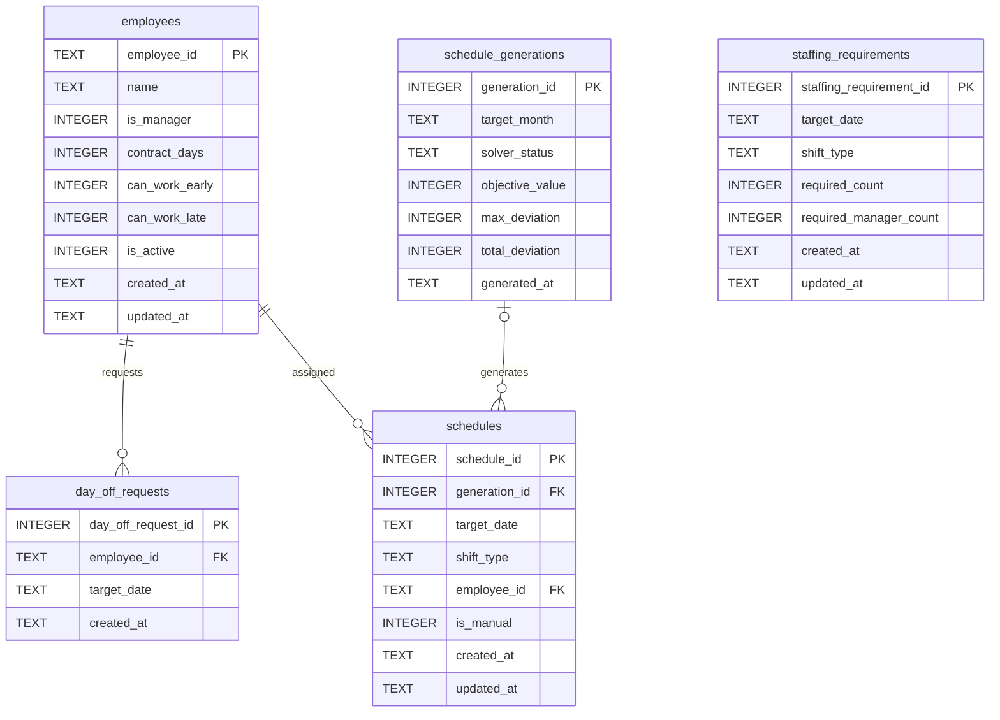

# シフト自動作成デモ データ定義書

## 1. 文書情報

| 項目           | 内容                            |
| -------------- | ------------------------------- |
| 文書名         | シフト自動作成デモ データ定義書 |
| ファイル名     | `04_data_definition.md`         |
| 対象システム   | `shift-scheduler`               |
| 対象バージョン | v1.0.0                          |
| 初版作成日     | 2026-08-01                      |
| 最終更新日     | 2026-08-02                      |

---

## 2. 本書の目的

本書は、シフト自動作成デモで使用するSQLiteテーブル、Pythonモデル、データ形式、整合性制約、更新・削除方針を定義する。

業務要件は`02_requirements.md`、システム構成は`03_system_design.md`、シフト生成で使用する制約の詳細は`05_schedule_constraints.md`に記載する。

---

## 3. データ設計方針

本システムでは、次の方針でデータを管理する。

- データベースにはSQLiteを使用する
- DBファイルはプロジェクトルート配下の`data/`へ保存する
- 日付はISO 8601形式の文字列`YYYY-MM-DD`で保存する
- 対象月は`YYYY-MM`形式で扱う
- 日時はタイムゾーン付きISO 8601形式で保存する
- 真偽値はSQLite上では`0`または`1`で保存する
- シフト区分は`early`または`late`とする
- 従業員は原則として物理削除せず、有効状態で管理する
- 希望休は1行を「1従業員・1日」とする
- 必要人数は1行を「1日・1シフト」とする
- シフト配置は1行を「1従業員・1日・1シフト」とする
- DB制約とアプリケーション側の検証を併用する
- DBレコードはRepository層でPythonモデルへ変換する
- 月間シフトはトランザクション内で一括置換する

---

## 4. データ構成

本システムでは、次の5テーブルを使用する。

| テーブル名              | 論理名         | 概要                       |
| ----------------------- | -------------- | -------------------------- |
| `employees`             | 従業員         | 従業員属性と勤務条件       |
| `day_off_requests`      | 希望休         | 従業員ごとの希望休日       |
| `staffing_requirements` | 必要人数       | 日付・シフトごとの必要人数 |
| `schedule_generations`  | シフト生成履歴 | 自動生成処理の結果         |
| `schedules`             | シフト配置     | 自動生成・手動変更後の配置 |

---

## 5. ER図



`staffing_requirements`と`schedules`の間には外部キーを設定しない。

両者は、`target_date`と`shift_type`の組み合わせによって論理的に対応する。

---

## 6. `employees`

## 6.1 概要

従業員の基本情報と、シフト生成に必要な勤務条件を管理する。

## 6.2 カラム定義

| カラム名         | SQLite型 | NULL | デフォルト | 制約       | 内容             |
| ---------------- | -------- | ---: | ---------: | ---------- | ---------------- |
| `employee_id`    | TEXT     | 不可 |       なし | PK         | 従業員ID         |
| `name`           | TEXT     | 不可 |       なし | 空文字不可 | 氏名             |
| `is_manager`     | INTEGER  | 不可 |          0 | 0または1   | 責任者区分       |
| `contract_days`  | INTEGER  | 不可 |       なし | 0〜31      | 月間契約勤務日数 |
| `can_work_early` | INTEGER  | 不可 |          1 | 0または1   | 早番勤務可否     |
| `can_work_late`  | INTEGER  | 不可 |          1 | 0または1   | 遅番勤務可否     |
| `is_active`      | INTEGER  | 不可 |          1 | 0または1   | 有効状態         |
| `created_at`     | TEXT     | 不可 |       なし | なし       | 作成日時         |
| `updated_at`     | TEXT     | 不可 |       なし | なし       | 更新日時         |

## 6.3 主キー

```text
employee_id
```

従業員IDはシステム内で一意とする。

## 6.4 CHECK制約

### 氏名

```sql
CHECK (length(trim(name)) > 0)
```

空文字または空白のみの氏名を拒否する。

### 責任者区分

```sql
CHECK (is_manager IN (0, 1))
```

### 契約勤務日数

```sql
CHECK (contract_days BETWEEN 0 AND 31)
```

### 勤務可能シフト

```sql
CHECK (can_work_early IN (0, 1))
CHECK (can_work_late IN (0, 1))
CHECK (can_work_early = 1 OR can_work_late = 1)
```

早番・遅番の両方を勤務不可にはできない。

### 有効状態

```sql
CHECK (is_active IN (0, 1))
```

## 6.5 業務ルール

- 従業員IDは登録後に原則変更しない
- 従業員は通常操作では物理削除しない
- 利用対象外となった従業員は`is_active = 0`とする
- 無効な従業員は新しいシフト生成の対象外とする
- 無効化前に登録された希望休やシフトは保持する

## 6.6 Pythonモデル

対応するモデルは`Employee`である。

```python
@dataclass(frozen=True)
class Employee:
    employee_id: str
    name: str
    is_manager: bool
    contract_days: int
    can_work_early: bool
    can_work_late: bool
    is_active: bool
```

SQLiteの整数値は、Repository層で`bool`へ変換する。

---

## 7. `day_off_requests`

## 7.1 概要

従業員ごとの希望休日を管理する。

1行は「1従業員・1日」の希望休を表す。

## 7.2 カラム定義

| カラム名             | SQLite型 | NULL | デフォルト | 制約       | 内容     |
| -------------------- | -------- | ---: | ---------: | ---------- | -------- |
| `day_off_request_id` | INTEGER  | 不可 |   自動採番 | PK         | 希望休ID |
| `employee_id`        | TEXT     | 不可 |       なし | FK         | 従業員ID |
| `target_date`        | TEXT     | 不可 |       なし | 日付文字列 | 希望日   |
| `created_at`         | TEXT     | 不可 |       なし | なし       | 作成日時 |

## 7.3 主キー

```text
day_off_request_id
```

`INTEGER PRIMARY KEY AUTOINCREMENT`を使用する。

## 7.4 一意制約

```sql
UNIQUE (employee_id, target_date)
```

同一従業員・同一日付の希望休を重複登録できない。

## 7.5 外部キー

```sql
FOREIGN KEY (employee_id)
    REFERENCES employees(employee_id)
    ON DELETE RESTRICT
```

希望休を持つ従業員は物理削除できない。

## 7.6 業務ルール

- 希望休は日単位とする
- シフト区分別の希望休は扱わない
- 対象月内の日付だけを登録する
- 無効な従業員への新規登録はアプリケーション側で拒否する
- 希望休は画面から物理削除できる

## 7.7 Pythonモデル

対応するモデルは`DayOffRequest`である。

```python
@dataclass(frozen=True)
class DayOffRequest:
    employee_id: str
    target_date: date
```

`day_off_request_id`と`created_at`は業務処理で直接使用しないため、モデルには含めない。

DB取得時に`target_date`を`datetime.date`へ変換する。

---

## 8. `staffing_requirements`

## 8.1 概要

日付・シフトごとの必要人数と必要責任者数を管理する。

1行は「1日・1シフト」の必要人数設定を表す。

## 8.2 カラム定義

| カラム名                  | SQLite型 | NULL | デフォルト | 制約           | 内容           |
| ------------------------- | -------- | ---: | ---------: | -------------- | -------------- |
| `staffing_requirement_id` | INTEGER  | 不可 |   自動採番 | PK             | 必要人数設定ID |
| `target_date`             | TEXT     | 不可 |       なし | 日付文字列     | 対象日         |
| `shift_type`              | TEXT     | 不可 |       なし | `early`/`late` | シフト区分     |
| `required_count`          | INTEGER  | 不可 |       なし | 0以上          | 必要人数       |
| `required_manager_count`  | INTEGER  | 不可 |       なし | 0以上          | 必要責任者数   |
| `created_at`              | TEXT     | 不可 |       なし | なし           | 作成日時       |
| `updated_at`              | TEXT     | 不可 |       なし | なし           | 更新日時       |

## 8.3 主キー

```text
staffing_requirement_id
```

## 8.4 シフト区分

```sql
CHECK (shift_type IN ('early', 'late'))
```

| 値      | 表示名 |
| ------- | ------ |
| `early` | 早番   |
| `late`  | 遅番   |

## 8.5 人数制約

```sql
CHECK (required_count >= 0)
CHECK (required_manager_count >= 0)
CHECK (required_manager_count <= required_count)
```

必要責任者数は必要人数を超えられない。

## 8.6 一意制約

```sql
UNIQUE (target_date, shift_type)
```

同一日付・同一シフトの設定は1件とする。

## 8.7 登録・更新方式

登録にはUPSERTを使用する。

同じ`target_date`と`shift_type`が存在する場合は、次を更新する。

- `required_count`
- `required_manager_count`
- `updated_at`

`created_at`は初回登録時の値を保持する。

## 8.8 Pythonモデル

対応するモデルは`StaffingRequirement`である。

```python
@dataclass(frozen=True)
class StaffingRequirement:
    target_date: date
    shift_type: ShiftType
    required_count: int
    required_manager_count: int
```

---

## 9. `schedule_generations`

## 9.1 概要

シフト自動生成処理の実行結果を管理する。

現在の画面では履歴一覧を表示しないが、生成されたシフトと生成条件の結果を関連付けるために保持する。

## 9.2 カラム定義

| カラム名          | SQLite型 | NULL | デフォルト | 制約        | 内容             |
| ----------------- | -------- | ---: | ---------: | ----------- | ---------------- |
| `generation_id`   | INTEGER  | 不可 |   自動採番 | PK          | 生成履歴ID       |
| `target_month`    | TEXT     | 不可 |       なし | `YYYY-MM`   | 対象月           |
| `solver_status`   | TEXT     | 不可 |       なし | 状態値制限  | Solver結果       |
| `objective_value` | INTEGER  |   可 |       NULL | なし        | 目的関数値       |
| `max_deviation`   | INTEGER  |   可 |       NULL | 0以上を想定 | 最大契約日数乖離 |
| `total_deviation` | INTEGER  |   可 |       NULL | 0以上を想定 | 契約日数乖離合計 |
| `generated_at`    | TEXT     | 不可 |       なし | ISO 8601    | 生成日時         |

## 9.3 主キー

```text
generation_id
```

## 9.4 Solver状態

```sql
CHECK (
    solver_status IN (
        'OPTIMAL',
        'FEASIBLE',
        'INFEASIBLE',
        'MODEL_INVALID',
        'UNKNOWN'
    )
)
```

| 値              | 内容                           |
| --------------- | ------------------------------ |
| `OPTIMAL`       | 最適解が見つかった             |
| `FEASIBLE`      | 実行可能解が見つかった         |
| `INFEASIBLE`    | 実行可能解が存在しない         |
| `MODEL_INVALID` | モデル定義が不正               |
| `UNKNOWN`       | 制限時間内に状態を確定できない |

スキーマ上はすべての状態を保存できる。

現在の業務処理では、`OPTIMAL`または`FEASIBLE`となった生成結果をシフトとともに保存する。

## 9.5 NULLの扱い

解が得られない場合を考慮し、次の列はNULLを許容する。

- `objective_value`
- `max_deviation`
- `total_deviation`

## 9.6 Pythonモデル

生成履歴テーブル専用のdataclassは設けていない。

生成処理の結果には、次のモデルを使用する。

```python
@dataclass(frozen=True)
class ScheduleGenerationResult:
    status: SolverStatus
    assignments: tuple[ScheduleAssignment, ...]
    objective_value: int | None
    max_deviation: int | None
    total_deviation: int | None
```

```python
@dataclass(frozen=True)
class ScheduleGenerationServiceResult:
    generated: bool
    solver_result: ScheduleGenerationResult | None
    validation_issues: tuple[ValidationIssue, ...]
    generation_id: int | None
```

---

## 10. `schedules`

## 10.1 概要

自動生成または手動変更後のシフト配置を管理する。

1行は「1従業員・1日・1シフト」の配置を表す。

## 10.2 カラム定義

| カラム名        | SQLite型 | NULL | デフォルト | 制約           | 内容           |
| --------------- | -------- | ---: | ---------: | -------------- | -------------- |
| `schedule_id`   | INTEGER  | 不可 |   自動採番 | PK             | シフト配置ID   |
| `generation_id` | INTEGER  |   可 |       NULL | FK             | 生成履歴ID     |
| `target_date`   | TEXT     | 不可 |       なし | 日付文字列     | 勤務日         |
| `shift_type`    | TEXT     | 不可 |       なし | `early`/`late` | シフト区分     |
| `employee_id`   | TEXT     | 不可 |       なし | FK             | 配置従業員ID   |
| `is_manual`     | INTEGER  | 不可 |          0 | 0または1       | 手動変更フラグ |
| `created_at`    | TEXT     | 不可 |       なし | なし           | 作成日時       |
| `updated_at`    | TEXT     | 不可 |       なし | なし           | 更新日時       |

## 10.3 主キー

```text
schedule_id
```

## 10.4 シフト区分

```sql
CHECK (shift_type IN ('early', 'late'))
```

## 10.5 手動変更フラグ

```sql
CHECK (is_manual IN (0, 1))
```

|  値 | 内容                                 |
| --: | ------------------------------------ |
|   0 | 自動生成された配置                   |
|   1 | 手動変更によって作成・変更された配置 |

## 10.6 一意制約

```sql
UNIQUE (target_date, employee_id)
```

同一従業員を同じ日に複数のシフトへ配置できない。

この制約により、DB上でも1人1日1シフトを保証する。

## 10.7 外部キー

### 生成履歴

```sql
FOREIGN KEY (generation_id)
    REFERENCES schedule_generations(generation_id)
    ON DELETE SET NULL
```

生成履歴を削除してもシフト配置は残し、`generation_id`をNULLとする。

### 従業員

```sql
FOREIGN KEY (employee_id)
    REFERENCES employees(employee_id)
    ON DELETE RESTRICT
```

シフト配置を持つ従業員は物理削除できない。

## 10.8 Pythonモデル

対応するモデルは`ScheduleAssignment`である。

```python
@dataclass(frozen=True)
class ScheduleAssignment:
    target_date: date
    shift_type: ShiftType
    employee_id: str
    is_manual: bool = False
```

`generation_id`、`schedule_id`、作成日時、更新日時は、通常の検証・表示処理では使用しないためモデルに含めない。

## 10.9 保存方式

### 自動生成

自動生成に成功した場合は、対象月の既存シフトを削除し、新しい配置を一括登録する。

登録する配置には同じ`generation_id`を設定する。

### 手動変更

手動変更を保存する場合も、対象月のシフト全体を一括置換する。

既存配置の個別UPDATEではなく、検証済み編集案を月単位で保存する。

### トランザクション

次の処理を同一トランザクション内で実行する。

```text
対象月の既存シフトを削除
    ↓
編集案または生成結果を一括登録
    ↓
コミット
```

登録途中で例外が発生した場合はロールバックする。

---

## 11. テーブル間の関係

## 11.1 従業員と希望休

```text
employees 1 ── N day_off_requests
```

1人の従業員は複数の希望休を持つ。

## 11.2 従業員とシフト配置

```text
employees 1 ── N schedules
```

1人の従業員は複数日のシフト配置を持つ。

## 11.3 生成履歴とシフト配置

```text
schedule_generations 1 ── N schedules
```

1回の自動生成処理は複数のシフト配置を持つ。

`schedules.generation_id`はNULLを許容するため、生成履歴と関連しない配置も保持できる。

## 11.4 必要人数とシフト配置

外部キーは設定しないが、次の組み合わせで論理的に対応する。

```text
target_date + shift_type
```

必要人数と実際の配置人数の一致はアプリケーション側で検証する。

---

## 12. Python型定義

## 12.1 `ShiftType`

```python
ShiftType = Literal["early", "late"]
```

シフト種別を早番または遅番に制限する。

## 12.2 `ValidationSeverity`

```python
ValidationSeverity = Literal[
    "error",
    "warning",
]
```

## 12.3 `SolverStatus`

```python
SolverStatus = Literal[
    "OPTIMAL",
    "FEASIBLE",
    "INFEASIBLE",
    "MODEL_INVALID",
    "UNKNOWN",
]
```

---

## 13. 検証結果モデル

## 13.1 `ValidationIssue`

```python
@dataclass(frozen=True)
class ValidationIssue:
    severity: ValidationSeverity
    rule_id: str
    message: str
    target_date: date | None = None
    shift_type: ShiftType | None = None
    employee_id: str | None = None
```

検証結果を画面とサービス間で受け渡す。

| 属性          | 内容                 |
| ------------- | -------------------- |
| `severity`    | エラーまたは警告     |
| `rule_id`     | 検証ルールID         |
| `message`     | 利用者向けメッセージ |
| `target_date` | 問題が発生した日     |
| `shift_type`  | 問題が発生したシフト |
| `employee_id` | 問題に関連する従業員 |

対象を特定できない全体的な問題では、任意項目をNULLとする。

---

## 14. 勤務集計モデル

## 14.1 `EmployeeScheduleSummary`

```python
@dataclass(frozen=True)
class EmployeeScheduleSummary:
    employee_id: str
    employee_name: str
    contract_days: int
    assigned_days: int
    difference: int
    early_count: int
    late_count: int
    max_consecutive_days: int
    manager_assignment_count: int
```

従業員別勤務集計の表示とCSV出力に使用する。

| 属性                       | 内容                       |
| -------------------------- | -------------------------- |
| `employee_id`              | 従業員ID                   |
| `employee_name`            | 氏名                       |
| `contract_days`            | 契約勤務日数               |
| `assigned_days`            | 割当勤務日数               |
| `difference`               | 割当日数と契約日数の差     |
| `early_count`              | 早番回数                   |
| `late_count`               | 遅番回数                   |
| `max_consecutive_days`     | 最大連続勤務日数           |
| `manager_assignment_count` | 責任者として配置された回数 |

---

## 15. DBとPythonモデルの対応

| DB・処理対象            | Pythonモデル                      |
| ----------------------- | --------------------------------- |
| `employees`             | `Employee`                        |
| `day_off_requests`      | `DayOffRequest`                   |
| `staffing_requirements` | `StaffingRequirement`             |
| `schedules`             | `ScheduleAssignment`              |
| 生成結果                | `ScheduleGenerationResult`        |
| 生成サービス結果        | `ScheduleGenerationServiceResult` |
| 検証結果                | `ValidationIssue`                 |
| 従業員別集計            | `EmployeeScheduleSummary`         |

DBの全カラムをPythonモデルへ含めるのではなく、業務処理で必要な値だけをモデル化する。

---

## 16. Repository変換方針

DBから取得した`sqlite3.Row`は、Repository層でモデルへ変換する。

主な変換関数は次のとおりである。

```text
_row_to_employee()
_row_to_day_off_request()
_row_to_staffing_requirement()
_row_to_schedule_assignment()
```

変換例：

```text
SQLite:
    is_manager = 1
    target_date = "2026-08-01"

Python:
    is_manager = True
    target_date = date(2026, 8, 1)
```

画面とサービス層は`sqlite3.Row`を直接扱わない。

---

## 17. 日付・日時の扱い

## 17.1 DB保存形式

| 種類   | 保存形式     | 例                          |
| ------ | ------------ | --------------------------- |
| 日付   | `YYYY-MM-DD` | `2026-08-01`                |
| 対象月 | `YYYY-MM`    | `2026-08`                   |
| 日時   | ISO 8601     | `2026-08-01T14:30:00+09:00` |

## 17.2 アプリケーション内

- 日付は`datetime.date`で扱う
- 日時は`datetime.datetime`で生成する
- DB登録時に`isoformat()`で文字列へ変換する
- DB取得時に`date.fromisoformat()`で日付へ変換する

## 17.3 対象月

対象月は`YYYY-MM`形式の文字列として扱う。

対象月から月初と翌月月初を求め、次の条件で月別データを取得する。

```sql
target_date >= 月初
AND target_date < 翌月月初
```

月末日を直接条件に使わないことで、月の日数の違いを吸収する。

---

## 18. 真偽値の扱い

SQLiteには専用のBOOLEAN型がないため、次の値を使用する。

| SQLite | Python  |
| -----: | ------- |
|      0 | `False` |
|      1 | `True`  |

対象カラム：

- `employees.is_manager`
- `employees.can_work_early`
- `employees.can_work_late`
- `employees.is_active`
- `schedules.is_manual`

DB登録時は`int(bool_value)`、取得時は`bool(row[column])`で変換する。

---

## 19. 作成日時・更新日時

日時は、アプリケーションを実行している環境のタイムゾーンを付与して保存する。

形式：

```python
datetime.now().astimezone().isoformat(
    timespec="seconds"
)
```

### 作成日時

新規登録時に設定する。

対象：

- `employees.created_at`
- `day_off_requests.created_at`
- `staffing_requirements.created_at`
- `schedules.created_at`
- `schedule_generations.generated_at`

### 更新日時

登録内容を変更したときに更新する。

対象：

- `employees.updated_at`
- `staffing_requirements.updated_at`
- `schedules.updated_at`

希望休には更新処理がなく、削除と再登録で対応するため`updated_at`を持たない。

---

## 20. 更新・削除方針

## 20.1 `employees`

- 新規登録はINSERT
- 属性変更はUPDATE
- 有効状態変更はUPDATE
- 原則として物理削除しない
- 従業員IDは変更しない

## 20.2 `day_off_requests`

- 新規登録はINSERT
- 内容変更は削除後に再登録
- 削除はDELETE
- 従業員削除時は`ON DELETE RESTRICT`

## 20.3 `staffing_requirements`

- 登録・更新はUPSERT
- 同一日付・同一シフトを更新対象とする
- 月全体を一括保存できる
- 削除が必要な場合は対象月を条件として実行する

## 20.4 `schedule_generations`

- 生成成功時にINSERT
- 原則として更新しない
- 生成履歴削除時は関連シフトの`generation_id`をNULLとする

## 20.5 `schedules`

- 単体登録・削除用Repository関数を持つ
- 自動生成結果は月単位で一括置換する
- 手動変更結果も月単位で一括置換する
- 月間置換はトランザクション内で実行する

---

## 21. 整合性制約

## 21.1 DBで保証する制約

| 制約                       | 実現方法 |
| -------------------------- | -------- |
| 従業員IDの重複防止         | 主キー   |
| 氏名の空文字防止           | CHECK    |
| bool値の不正値防止         | CHECK    |
| 契約勤務日数の範囲         | CHECK    |
| 勤務可能シフト0件の防止    | CHECK    |
| 希望休の重複防止           | UNIQUE   |
| 必要人数設定の重複防止     | UNIQUE   |
| 責任者数が必要人数以下     | CHECK    |
| シフト種別の値制限         | CHECK    |
| 同一従業員の同日重複配置   | UNIQUE   |
| 存在しない従業員の参照防止 | 外部キー |

## 21.2 アプリケーションで保証する制約

| 制約                       | 理由                               |
| -------------------------- | ---------------------------------- |
| 希望休への配置禁止         | 複数テーブルを参照するため         |
| 勤務不可シフトへの配置禁止 | 従業員属性との比較が必要なため     |
| 必要人数の一致             | 必要人数表との集計比較が必要なため |
| 責任者人数の充足           | 従業員属性との集計が必要なため     |
| 週5日上限                  | 日付を週単位で集計するため         |
| 最大5連勤                  | 日付の連続判定が必要なため         |
| 無効従業員の配置禁止       | 従業員状態との比較が必要なため     |
| 契約勤務日数との差         | 集計・最適化が必要なため           |

---

## 22. DB接続設定

DBファイルのパスは、`src/db.py`を基準にプロジェクトルートを求めて決定する。

概念的な構成：

```text
project_root/
└── data/
    └── shift_scheduler.db
```

実行時のカレントディレクトリに依存しない。

接続時には次を設定する。

```python
connection.row_factory = sqlite3.Row
connection.execute("PRAGMA foreign_keys = ON")
```

`sqlite3.Row`によりカラム名で値を取得し、外部キー制約を接続ごとに有効化する。

---

## 23. DB初期化

`init_db()`は、`CREATE TABLE IF NOT EXISTS`を使用して5テーブルを作成する。

- 既存テーブルを削除しない
- 既存データを変更しない
- 必要なディレクトリがなければ作成する
- アプリの各ページから実行できる

現在は専用のマイグレーションツールを導入していない。

テーブル構造を変更する場合は、既存DBとの互換性を個別に確認する必要がある。

---

## 24. DB整合性確認

`scripts/check_db.py`では、主に次を確認する。

- 外部キー違反
- 同一従業員の同日重複配置
- 不正なシフト区分
- テーブル構造

DB制約によって通常は不正データを登録できないが、既存DBや外部操作による破損を確認する目的で使用する。

---

## 25. 表示・出力用データ

画面表示やCSV出力では、DBテーブルをそのまま表示せず、PythonモデルからDataFrameへ変換する。

### 25.1 月間シフト表

| 列   | 内容         |
| ---- | ------------ |
| 日付 | 対象日       |
| 曜日 | 月〜日       |
| 早番 | 早番配置者名 |
| 遅番 | 遅番配置者名 |

### 25.2 配置明細

| 列       | 内容           |
| -------- | -------------- |
| 日付     | 勤務日         |
| 曜日     | 月〜日         |
| シフト   | 早番・遅番     |
| 従業員ID | 配置従業員ID   |
| 氏名     | 従業員名       |
| 責任者   | 責任者区分     |
| 手動変更 | 手動変更の有無 |

### 25.3 従業員別勤務集計

| 列               | 内容                   |
| ---------------- | ---------------------- |
| 従業員ID         | 従業員ID               |
| 氏名             | 氏名                   |
| 契約勤務日数     | 月間目標日数           |
| 割当勤務日数     | 実際の勤務日数         |
| 差               | 割当日数と契約日数の差 |
| 早番回数         | 早番配置回数           |
| 遅番回数         | 遅番配置回数           |
| 最大連続勤務日数 | 対象月内の最大連勤     |
| 責任者配置回数   | 責任者としての配置回数 |

DataFrameは永続データではなく、表示・出力時に生成する。

---

## 26. サンプルデータ方針

デモデータを作成する場合は、次の構成を基本とする。

### 26.1 従業員

- 従業員数：6〜10人程度
- 責任者：2〜4人
- 一般従業員：残りの従業員
- 契約勤務日数：10〜22日程度
- 早番のみ勤務可能な従業員を含める
- 遅番のみ勤務可能な従業員を含める
- 両方勤務可能な従業員を含める

### 26.2 希望休

- 1人あたり月2〜4日程度
- 希望休が分散した正常ケース
- 特定日に希望休が集中する異常ケース

### 26.3 必要人数

- 解が存在する正常ケース
- 責任者候補が不足するケース
- 勤務可能者が不足するケース
- 契約勤務日数合計と必要勤務枠が異なるケース
- 週5日上限を考慮すると配置数が不足するケース

実在する個人名や機密情報は使用しない。

---

## 27. 現在の制約

データ設計上、次の制約がある。

- 単一事業所を前提としており店舗IDを持たない
- シフト区分をテーブル化していない
- 早番・遅番の2種類に固定している
- 勤務時間や休憩時間を持たない
- 利用者や権限のテーブルを持たない
- 操作履歴を保存しない
- 生成条件のスナップショットを履歴へ保存しない
- 手動変更の変更履歴を保存しない
- DBマイグレーション機構を持たない
- SQLiteのため多数利用者による同時書込みに向かない

---

## 28. 将来の拡張候補

将来的には、次のデータ構造を追加できる。

- `locations`：店舗・事業所
- `users`：ログイン利用者
- `roles`：権限
- `shift_types`：シフト種別マスタ
- `employee_availabilities`：曜日・時間帯ごとの勤務可否
- `work_patterns`：勤務パターン
- `schedule_change_logs`：手動変更履歴
- `operation_logs`：操作履歴
- `generation_conditions`：生成条件のスナップショット
- `holidays`：休日・祝日
- `paid_leave_balances`：有給休暇残数

これらを追加する場合は、既存の単一事業所・2シフト前提を見直す。

---

## 29. 関連文書

| 文書                         | 内容                 |
| ---------------------------- | -------------------- |
| `README.md`                  | アプリ概要と起動方法 |
| `01_overview.md`             | 背景、目的、対象業務 |
| `02_requirements.md`         | 機能・非機能要件     |
| `03_system_design.md`        | システム構成         |
| `05_schedule_constraints.md` | 制約・最適化ロジック |
| `06_screen_design.md`        | 画面仕様             |
| `08_test_plan.md`            | テスト方針           |
| `09_test_report.md`          | テスト結果           |
