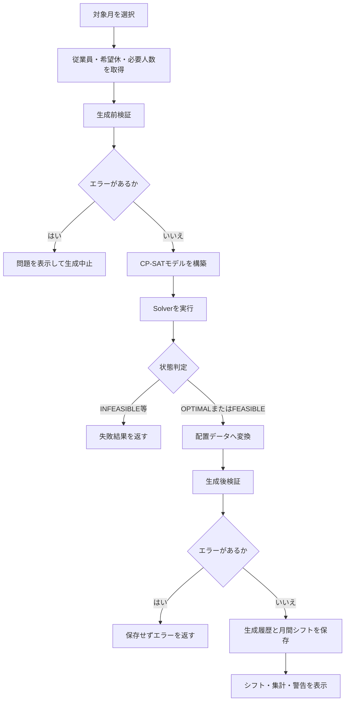

# シフト生成・制約設計書

## 1. 文書情報

| 項目           | 内容                                      |
| -------------- | ----------------------------------------- |
| 文書名         | シフト自動作成デモ シフト生成・制約設計書 |
| ファイル名     | `05_schedule_constraints.md`              |
| 対象システム   | `shift-scheduler`                         |
| 対象バージョン | v1.0.0予定                                |
| 初版作成日     | 2026-08-02                                |
| 最終更新日     | 2026-08-03                                |

---

## 2. 本書の目的

本書は、シフト自動作成デモにおける次の内容を定義する。

- シフト生成の入力と出力
- OR-Toolsによる最適化モデル
- 決定変数
- ハード制約
- 目的関数
- 生成前検証
- 生成後検証
- 手動変更後の再検証
- Solver状態の扱い
- 現在の制約と拡張方針

機能要件は`02_requirements.md`、システム全体の構成は`03_system_design.md`、DBとPythonモデルは`04_data_definition.md`に記載する。

---

## 3. シフト生成の目的

シフト生成処理は、従業員情報、希望休、必要人数をもとに、対象月の勤務配置を決定する。

生成結果は、次の2段階の条件を満たす必要がある。

1. 必須条件であるハード制約をすべて満たす
2. 実行可能なシフトの中で、契約勤務日数との差をできるだけ小さくする

本システムでは、Google OR-ToolsのCP-SAT Solverを使用する。

シフト作成を単なるランダム配置として扱わず、制約充足問題および整数最適化問題としてモデル化する。

---

## 4. シフト生成処理の全体像



生成処理は、Solverが解を返しただけでは成功としない。

生成された配置を通常の検証処理に通し、ハード制約違反がないことを確認してから保存する。

---

## 5. 入力データ

シフト生成では、次のデータを使用する。

### 5.1 対象月

形式：

```text
YYYY-MM
```

例：

```text
2026-08
```

対象月の日付は、必要人数設定に含まれる日付を基に生成モデルへ取り込む。

生成前検証では、対象月のすべての日付について早番・遅番の必要人数設定が存在することを確認する。

---

### 5.2 従業員

使用する属性：

| 属性             | 用途                     |
| ---------------- | ------------------------ |
| `employee_id`    | 決定変数と配置結果の識別 |
| `is_manager`     | 責任者配置制約           |
| `contract_days`  | 目的関数                 |
| `can_work_early` | 早番勤務可否制約         |
| `can_work_late`  | 遅番勤務可否制約         |
| `is_active`      | 生成対象の絞り込み       |

生成モデルには、有効状態の従業員だけを含める。

無効な従業員については決定変数自体を作成しない。

---

### 5.3 希望休

希望休は、次の組み合わせで管理する。

```text
従業員ID + 対象日
```

希望休に登録された日は、早番・遅番の両方を勤務不可とする。

現在は「早番だけ休み」「遅番だけ休み」のようなシフト単位の希望休は扱わない。

---

### 5.4 必要人数

日付・シフトごとに次を使用する。

| 属性                     | 用途               |
| ------------------------ | ------------------ |
| `target_date`            | 対象日             |
| `shift_type`             | 早番または遅番     |
| `required_count`         | 配置すべき従業員数 |
| `required_manager_count` | 配置すべき責任者数 |

シフト区分：

```text
early
late
```

必要人数は、その人数以上ではなく、設定値と完全に一致させる。

必要責任者数は、設定値以上とする。

---

## 6. 出力データ

生成処理は`ScheduleGenerationResult`として次の情報を返す。

| 属性              | 内容                     |
| ----------------- | ------------------------ |
| `status`          | Solver状態               |
| `assignments`     | 生成された配置           |
| `objective_value` | 目的関数値               |
| `max_deviation`   | 契約勤務日数との最大乖離 |
| `total_deviation` | 全従業員の乖離合計       |

1件の配置は`ScheduleAssignment`として表す。

```python
ScheduleAssignment(
    target_date=...,
    shift_type=...,
    employee_id=...,
    is_manual=False,
)
```

自動生成された配置では、`is_manual=False`とする。

---

## 7. 集合と記号

本書では、モデルを次の記号で表す。

| 記号          | 内容                             |
| ------------- | -------------------------------- |
| $(E)$         | 有効な従業員の集合               |
| $(D)$         | 対象月の日付の集合               |
| $(S)$         | シフト区分の集合                 |
| $(M)$         | 責任者である従業員の集合         |
| $(D_w)$       | 週(w)に含まれる対象月内の日付    |
| $(R_{d,s})$   | 日付(d)、シフト(s)の必要人数     |
| $(R^M_{d,s})$ | 日付(d)、シフト(s)の必要責任者数 |
| $(C_e)$       | 従業員(e)の契約勤務日数          |

シフト区分の集合は次のとおりである。

$$S = \{\mathrm{early},\ \mathrm{late}\}$$

---

## 8. 決定変数

### 8.1 配置変数

従業員、日付、シフトの組み合わせごとに、0または1の変数を定義する。

$$
x_{e,d,s} =
\begin{cases}
1 & \text{従業員 } e \text{ を日付 } d \text{ のシフト } s \text{ に配置する場合} \\
0 & \text{配置しない場合}
\end{cases}
$$

実装上は次の形式で変数名を作成する。

```text
work_{employee_id}_{target_date}_{shift_type}
```

例：

```text
work_E001_2026-08-01_early
```

---

### 8.2 日単位勤務変数

従業員が対象日に勤務するかを表す変数を定義する。

$$
y_{e,d} =
\begin{cases}
1 & \text{従業員 } e \text{ が日付 } d \text{ に勤務する場合} \\
0 & \text{勤務しない場合}
\end{cases}
$$

配置変数との関係は次のとおりである。

$$y_{e,d} = \sum_{s \in S} x_{e,d,s}$$

1日1シフト制約があるため、右辺は0または1となる。

実装上の変数名：

```text
works_day_{employee_id}_{target_date}
```

---

### 8.3 月間勤務日数

従業員ごとの月間割当勤務日数を表す。

$$A_e = \sum_{d \in D} y_{e,d}$$

実装では0から対象月日数までの整数変数とする。

変数名：

```text
assigned_days_{employee_id}
```

---

### 8.4 契約勤務日数との乖離

従業員ごとに、割当勤務日数と契約勤務日数との差の絶対値を定義する。

$$\delta_e = \left|A_e - C_e\right|$$

実装ではOR-Toolsの絶対値等式を使用する。

```python
model.add_abs_equality(
    deviation,
    assigned_days[employee_id]
    - employee.contract_days,
)
```

---

### 8.5 最大乖離

全従業員のうち、最も大きい乖離を表す。

$$\delta_{\max} = \max_{e \in E} \delta_e$$

実装では各従業員について次を設定する。

$$\delta_{\max} \geq \delta_e \qquad \forall e \in E$$

変数名：

```text
max_deviation
```

---

### 8.6 乖離合計

全従業員の乖離合計を表す。

$$\delta_{\mathrm{total}} = \sum_{e \in E} \delta_e$$

変数名：

```text
total_deviation
```

---

## 9. ハード制約一覧

| 制約ID | 制約名             | 内容                                      |
| ------ | ------------------ | ----------------------------------------- |
| HC-01  | 1日1シフト制約     | 同じ従業員を1日に複数シフトへ配置しない   |
| HC-02  | 希望休制約         | 希望休の日には配置しない                  |
| HC-03  | 勤務可能シフト制約 | 勤務不可のシフトへ配置しない              |
| HC-04  | 必要人数制約       | 日付・シフトごとの必要人数を満たす        |
| HC-05  | 責任者配置制約     | 必要責任者数を満たす                      |
| HC-06  | 週間勤務日数制約   | 月曜日から日曜日までの勤務を最大5日とする |
| HC-07  | 連続勤務制約       | 6日間のうち勤務を最大5日とする            |
| HC-08  | 有効従業員制約     | 無効な従業員を配置しない                  |

---

## 10. HC-01 1日1シフト制約

従業員は、同じ日に早番と遅番の両方へ配置できない。

$$\sum_{s \in S} x_{e,d,s} \leq 1 \qquad \forall e \in E,\ \forall d \in D$$

例：

| 早番 | 遅番 | 判定 |
| ---: | ---: | ---- |
|    0 |    0 | 可   |
|    1 |    0 | 可   |
|    0 |    1 | 可   |
|    1 |    1 | 不可 |

DB側でも、`target_date`と`employee_id`の一意制約によって重複配置を防止する。

この制約は、最適化モデル、生成後検証、DB制約の3段階で保証する。

---

## 11. HC-02 希望休制約

希望休の日は、早番・遅番の両方を0とする。

従業員$(e)$が日付$(d)$を希望休としている場合：

$$x_{e,d,s} = 0 \qquad \forall s \in S$$

希望休に登録されている従業員が無効状態の場合、その従業員は生成モデルに含まれないため処理対象外となる。

生成前検証では、希望休を除いた勤務可能者数が必要人数を満たせるかも確認する。

---

## 12. HC-03 勤務可能シフト制約

従業員が勤務不可としているシフトには配置しない。

早番勤務不可の場合：

$$x_{e,d,\mathrm{early}} = 0 \qquad \forall d \in D$$

遅番勤務不可の場合：

$$x_{e,d,\mathrm{late}} = 0 \qquad \forall d \in D$$

従業員は、早番・遅番の少なくとも一方を勤務可能とする。

この条件は従業員登録時とDBのCHECK制約でも保証する。

---

## 13. HC-04 必要人数制約

各日・各シフトの配置人数を、設定された必要人数と一致させる。

$$\sum_{e \in E} x_{e,d,s} = R_{d,s} \qquad \forall d \in D,\ \forall s \in S$$

必要人数が2人の場合、1人や3人の配置は認めない。

必要人数を0人に設定した場合は、その日・シフトには誰も配置しない。

---

## 14. HC-05 責任者配置制約

各日・各シフトに、設定された人数以上の責任者を配置する。

$$\sum_{e \in M} x_{e,d,s} \geq R^{M}_{d,s} \qquad \forall d \in D,\ \forall s \in S$$

必要責任者数が0人の場合、この制約は追加しない。

責任者の配置数は必要数以上であればよく、必要数と完全一致させる必要はない。

ただし、全体の配置人数はHC-04によって必要人数と一致する。

---

## 15. HC-06 週間勤務日数制約

従業員1人あたりの週間勤務日数を最大5日とする。

$$\sum_{d \in D_w} y_{e,d} \leq 5 \qquad \forall e \in E,\ \forall w$$

週は月曜日から日曜日までとする。

実装では、各日付からその週の月曜日を求め、同じ週に属する日付をグループ化する。

```python
week_start = (
    target_date
    - timedelta(days=target_date.weekday())
)
```

対象月の先頭または末尾にある不完全な週については、対象月内の日付だけを集計する。

例として、対象月が水曜日から始まる場合、その週については水曜日から日曜日までだけを判定する。

前月の月曜日・火曜日の勤務は現在の判定に含めない。

---

## 16. HC-07 連続勤務制約

6日以上の連続勤務を禁止する。

対象月内の連続した6日間について、勤務日数を最大5日とする。

$$\sum_{k=0}^{5} y_{e,d+k} \leq 5 \qquad \forall e \in E$$

これにより、任意の6日間のうち少なくとも1日は休みとなる。

例：

| 6日間の勤務            | 判定 |
| ---------------------- | ---- |
| 勤・勤・勤・勤・勤・休 | 可   |
| 休・勤・勤・勤・勤・勤 | 可   |
| 勤・勤・勤・勤・勤・勤 | 不可 |

実装では、対象月内に6日間の窓が完全に含まれる場合だけ制約を設定する。

前月末から続く連続勤務と、翌月初まで続く連続勤務は現在の判定対象外とする。

---

## 17. HC-08 有効従業員制約

無効な従業員を新しいシフトへ配置しない。

実装では、有効な従業員だけを抽出して決定変数を作成する。

```python
active_employees = [
    employee
    for employee in employees
    if employee.is_active
]
```

そのため、無効な従業員については次の変数自体が存在しない。

$$x[e, d, s]$$

手動変更後の検証では、無効な従業員が配置に含まれていないかを別途確認する。

---

## 18. 目的関数

本システムでは、次の順番で勤務日数の公平性を評価する。

1. 最も大きい契約勤務日数との差を小さくする
2. 全従業員の差の合計を小さくする

概念的には辞書式最適化に近い優先順位を持たせる。

---

## 19. 最大乖離の最小化

最初に、特定の従業員だけが契約勤務日数から大きく外れることを防ぐ。

最小化対象：$\delta_{\max}=\max_{e \in E} \delta_e$

例：

### シフト案A

| 従業員 | 乖離 |
| ------ | ---: |
| E001   |    0 |
| E002   |    0 |
| E003   |    0 |
| E004   |    8 |

最大乖離：

```text
8
```

### シフト案B

| 従業員 | 乖離 |
| ------ | ---: |
| E001   |    2 |
| E002   |    2 |
| E003   |    2 |
| E004   |    2 |

最大乖離：

```text
2
```

乖離合計が同じでも、シフト案Bを優先する。

---

## 20. 乖離合計の最小化

最大乖離が同程度の解の中で、全従業員の乖離合計を小さくする。

最小化対象：$\delta_{\mathrm{total}}= \sum_{e \in E} \delta_e$

これにより、全体として契約勤務日数に近い配置を選ぶ。

---

## 21. 重み付き目的関数

実装では、最大乖離を優先するため、重み付きの単一目的関数へ変換する。

従業員数を$(n)$、対象月の日数を$(m)$とした場合、乖離合計の最大値を次のように定義する。

$$T_{\max} = n \times m$$

最大乖離の重み：$W = T_{\max} + 1$

目的関数：$\operatorname{Minimize} \left( W\delta_{\max} + \delta_{\mathrm{total}} \right)$

重み$(W)$を乖離合計の最大値より大きくすることで、最大乖離が1増える不利益を、乖離合計の改善では打ち消せないようにする。

---

## 22. 目的関数値の解釈

Solverが返す`objective_value`は、次の重み付き合計である。

```text
max_deviation × weight
+ total_deviation
```

この値は同じ対象月・従業員数の生成結果を比較する場合には利用できる。

ただし、従業員数や対象月日数が異なる場合は重みも変わるため、異なる条件間で単純比較する指標ではない。

画面上では、目的関数値だけでなく次も個別に表示する。

- 最大乖離
- 乖離合計

---

## 23. 最適化していない項目

現在の目的関数では、次の項目を直接最適化していない。

- 早番と遅番の回数バランス
- 責任者間の配置回数バランス
- 土日勤務の公平性
- 希望勤務日の反映
- 連続する早番・遅番の回数
- 遅番翌日の早番回避
- 勤務時間
- 残業時間

早番・遅番の偏りと責任者配置の偏りは、生成後の集計および警告として確認する。

---

## 24. 生成前検証

Solverを実行する前に、明らかに生成できない条件や確認が必要な条件を検出する。

生成前検証には、次の目的がある。

- 不要なSolver実行を避ける
- 利用者へ具体的な修正箇所を示す
- モデル構築前に入力値の妥当性を確認する
- 解なしの原因を可能な範囲で説明する

---

## 25. 生成前検証ルール

| ルールID | 検証内容                                | 重大度  |
| -------- | --------------------------------------- | ------- |
| PV-01    | 有効な従業員が存在するか                | error   |
| PV-02    | 必要な場合に有効な責任者が存在するか    | error   |
| PV-03    | 全日・全シフトに必要人数設定があるか    | error   |
| PV-04    | 必要人数分の勤務可能者がいるか          | error   |
| PV-05    | 必要数の責任者候補がいるか              | error   |
| PV-06    | 契約勤務日数合計が必要勤務枠より少ない  | warning |
| PV-07    | 契約勤務日数合計が必要勤務枠より多い    | warning |
| PV-08    | 契約勤務日数が対象月の日数を超える      | warning |
| PV-09    | 必要人数設定の値が不正でないか          | error   |
| PV-10    | 週5日上限を考慮した最大配置数が足りるか | error   |

---

## 26. PV-01 有効従業員の存在

有効な従業員が1人も存在しない場合、生成できない。

判定：

```text
有効従業員数 = 0
```

結果：

```text
error
```

---

## 27. PV-02 有効責任者の存在

必要責任者数が1人以上に設定されたシフトが存在する場合、有効な責任者が最低1人必要となる。

次の場合はエラーとする。

```text
責任者配置が必要
かつ
有効な責任者数 = 0
```

この検証はシステム全体に責任者が存在するかを確認する。

特定の日・シフトに配置可能かどうかはPV-05で確認する。

---

## 28. PV-03 必要人数設定の完全性

対象月のすべての日付について、早番・遅番の設定が必要となる。

必要な組み合わせ数：$対象月の日数 \times 2$

不足している日付・シフトごとにエラーを返す。

例：

```text
2026-08-15 早番の必要人数が未設定
```

---

## 29. PV-04 配置可能人数

日付・シフトごとに、配置候補者数が必要人数以上であるか確認する。

候補者は次をすべて満たす従業員とする。

- 有効である
- 対象日が希望休ではない
- 対象シフトを勤務可能である

判定：

$$N^{\mathrm{available}}_{d,s} \geq R_{d,s}$$

不足する場合は、不足人数をメッセージへ含める。

この検証は日単位・シフト単位の候補者数だけを確認する。

週5日制約や連続勤務制約を組み合わせた結果として解が存在するかまでは判定しない。

---

## 30. PV-05 配置可能責任者数

日付・シフトごとに、配置可能な責任者候補が必要数以上であるか確認する。

候補者は次をすべて満たす従業員とする。

- 有効である
- 責任者である
- 対象日が希望休ではない
- 対象シフトを勤務可能である

判定：

$$N^{\mathrm{manager}}_{d,s} \geq R^{M}_{d,s}$$

必要責任者数が0の場合は検証対象外とする。

---

## 31. PV-06・PV-07 契約勤務日数合計

必要勤務枠の合計を次のように求める。

必要勤務枠：$R_{\mathrm{total}} = \sum_{d \in D} \sum_{s \in S} R_{d,s}$

契約勤務日数合計：$C_{\mathrm{total}} = \sum_{e \in E} C_e$

両者が一致しない場合は警告とする。

### 契約勤務日数合計が少ない場合

一部従業員が契約勤務日数を超える可能性がある。

### 契約勤務日数合計が多い場合

一部従業員が契約勤務日数へ届かない可能性がある。

契約勤務日数はハード制約ではないため、差があっても生成は実行できる。

---

## 32. PV-08 対象月日数を超える契約日数

従業員の契約勤務日数が対象月の日数を超えている場合、警告とする。

例：

```text
対象月：28日
契約勤務日数：30日
```

1人1日1シフト制約により、対象月の日数を超える勤務は割り当てられない。

---

## 33. PV-09 必要人数設定値

次のいずれかに該当する場合はエラーとする。

- 必要人数が0未満
- 必要責任者数が0未満
- 必要責任者数が必要人数を超える

通常は画面入力とDB制約でも防止するが、生成処理の入口でも確認する。

---

## 34. PV-10 週間配置可能数

週5日上限を考慮した、全従業員の理論上の最大配置可能数を求める。

対象月の日付をISO週ごとに分け、1人あたりの配置可能数を次のように計算する。

1人あたり最大配置数：$K_{\mathrm{employee}} = \sum_{w} \min\left(\left|D_w\right|,\ 5\right)$

全従業員の最大配置数：$K_{\mathrm{total}} = |E| \times K_{\mathrm{employee}}$

次の場合はエラーとする。

$$K_{\mathrm{total}} \leq R_{\mathrm{total}}$$

この検証は週5日上限だけを考慮した上限値であり、希望休、シフト可否、責任者条件、連続勤務条件を同時には考慮しない。

---

## 35. 事前検証の限界

生成前検証でエラーがなくても、必ず実行可能解が存在するとは限らない。

例えば、次のような条件の組み合わせは、個別検証を通過しても全体として解が存在しない可能性がある。

- 特定の責任者へ勤務可能日が集中している
- 希望休と週5日制約が複雑に重なる
- 最大5連勤と必要人数が同時に成立しない
- 早番のみ・遅番のみの従業員構成が偏っている
- 各日には候補者がいるが、月全体として配置が成立しない

最終的な実行可能性はSolverが判定する。

---

## 36. Solver設定

OR-Toolsの`CpSolver`を使用する。

主な設定：

| 設定                  | 内容           |
| --------------------- | -------------- |
| `max_time_in_seconds` | 最大実行時間   |
| `num_search_workers`  | 探索ワーカー数 |

標準値：

```text
max_time_seconds = 30.0
num_search_workers = 1
```

テストでは再現性を高めるため、ワーカー数を1にする。

ワーカー数を増やすと高速化する場合があるが、解探索の順序や結果の再現性が変わる可能性がある。

---

## 37. Solver状態

OR-Toolsの状態を、システム内の文字列へ変換する。

| 状態            | 意味                           | 配置の保存 |
| --------------- | ------------------------------ | ---------- |
| `OPTIMAL`       | 最適解が見つかった             | 保存候補   |
| `FEASIBLE`      | 実行可能解が見つかった         | 保存候補   |
| `INFEASIBLE`    | 条件を満たす解がない           | 保存しない |
| `MODEL_INVALID` | モデル定義が不正               | 保存しない |
| `UNKNOWN`       | 制限時間内に状態を確定できない | 保存しない |

`OPTIMAL`と`FEASIBLE`の違いは、最適性が証明されているかどうかである。

`FEASIBLE`でもすべてのハード制約は満たしているが、より良い目的関数値の解が存在する可能性がある。

---

## 38. 解が得られなかった場合

状態が`OPTIMAL`または`FEASIBLE`以外の場合、次の結果を返す。

```text
assignments = 空
objective_value = None
max_deviation = None
total_deviation = None
```

生成失敗のSolver状態は、生成履歴として保存する。

月間シフトは置き換えない。

既存の対象月シフトがある場合も、失敗によって削除しない。

---

## 39. 生成結果の配置変換

Solverが配置変数を1とした組み合わせを、`ScheduleAssignment`へ変換する。

```python
ScheduleAssignment(
    target_date=target_date,
    shift_type=shift_type,
    employee_id=employee_id,
    is_manual=False,
)
```

変換後は次の順番で並べる。

1. 日付
2. 早番・遅番
3. 従業員ID

シフト順：

```text
early
late
```

---

## 40. 生成後検証

Solverが`OPTIMAL`または`FEASIBLE`を返した場合、生成された配置を再検証する。

生成後検証の目的は次のとおりである。

- 最適化モデルと業務検証の不一致を検出する
- モデル変更時の制約追加漏れを検出する
- Solver結果を保存する前に安全性を確認する
- 手動変更時と同じ検証基準を使用する

生成後検証でエラーが見つかった場合、シフトを保存しない。

---

## 41. 生成後検証の主な項目

| 制約ID | 確認内容                 |
| ------ | ------------------------ |
| HC-01  | 同じ従業員の同日重複配置 |
| HC-02  | 希望休への配置           |
| HC-03  | 勤務不可シフトへの配置   |
| HC-04  | 必要人数との一致         |
| HC-05  | 責任者数の充足           |
| HC-06  | 週5日上限                |
| HC-07  | 最大5連勤                |
| HC-08  | 無効従業員の配置         |

加えて、次の異常も検出対象とする。

- 存在しない従業員ID
- 不正なシフト区分
- 契約勤務日数との差
- 早番・遅番回数の偏り
- 責任者配置回数の偏り

---

## 42. エラーと警告

検証結果は次の2種類に分ける。

| 重大度    | 意味                           |
| --------- | ------------------------------ |
| `error`   | 保存を許可しない問題           |
| `warning` | 保存は可能だが確認が必要な状態 |

生成前検証でエラーがある場合、Solverを実行しない。

生成後検証でエラーがある場合、Solverが解を返していても保存しない。

警告だけの場合は保存できる。

---

## 43. 警告基準

現在の警告基準は次のとおりである。

| 警告ID | 内容                                          |
| ------ | --------------------------------------------- |
| WR-01  | 契約勤務日数との差の絶対値が3日以上           |
| WR-02  | 両シフト勤務可能者の早番・遅番回数差が5回以上 |
| WR-03  | 責任者間の配置回数差が5回以上                 |
| WR-04  | 必要勤務枠と契約勤務日数合計が一致しない      |

これらは保存を妨げない。

警告値は現在、コード内の業務ルールとして定義し、画面から変更できない。

---

## 44. 従業員別勤務集計

生成後または保存済みシフトについて、従業員ごとに次を集計する。

| 項目             | 内容                           |
| ---------------- | ------------------------------ |
| 契約勤務日数     | 従業員マスタの目標日数         |
| 割当勤務日数     | 実際に配置された日数           |
| 差               | 割当勤務日数－契約勤務日数     |
| 早番回数         | 早番へ配置された回数           |
| 遅番回数         | 遅番へ配置された回数           |
| 最大連続勤務日数 | 対象月内で最も長い連勤         |
| 責任者配置回数   | 責任者としてシフトへ入った回数 |

責任者配置回数は、責任者である従業員が勤務した回数を表す。

同じ配置について、一般配置と責任者配置を別々に記録するわけではない。

---

## 45. 保存条件

生成結果を保存するには、次の条件をすべて満たす必要がある。

- Solver状態が`OPTIMAL`または`FEASIBLE`
- 生成後検証にエラーがない
- 目的関数値が取得できている
- 最大乖離が取得できている
- 乖離合計が取得できている

保存時には次を記録する。

### 生成履歴

- 対象月
- Solver状態
- 目的関数値
- 最大乖離
- 乖離合計
- 生成日時

### シフト配置

- 生成履歴ID
- 対象日
- シフト区分
- 従業員ID
- 手動変更フラグ
- 作成日時
- 更新日時

---

## 46. 月間シフトの置換

自動生成に成功した場合、対象月の既存シフトを新しい配置で置き換える。

処理：

```text
生成履歴を登録
    ↓
対象月の既存シフトを削除
    ↓
新しい配置を一括登録
    ↓
コミット
```

一連の処理は同じトランザクション内で実行する。

登録途中で例外が発生した場合はロールバックし、既存シフトを保持する。

---

## 47. 手動変更との関係

自動生成後のシフトは、手動変更画面で次のいずれかへ変更できる。

- 早番
- 遅番
- 休み

変更内容はDBへ即時保存せず、編集案として保持する。

編集案は自動生成結果と同じ検証処理へ渡す。

そのため、手動変更によって次のような問題が生じた場合も検出できる。

- 必要人数不足
- 責任者不足
- 希望休への配置
- 勤務不可シフトへの配置
- 週6日勤務
- 6日連続勤務
- 無効従業員の配置

---

## 48. 手動変更後の保存条件

手動変更後の編集案に`error`が1件以上ある場合、保存できない。

`warning`だけの場合は保存できる。

保存時は、対象月のシフト全体を一括置換する。

手動で追加または変更された配置には次を設定する。

```text
is_manual = True
```

休みへ変更した場合は、その従業員・日付の配置を削除する。

---

## 49. 編集案の破棄

編集案はStreamlitのsession stateに保持する。

破棄操作では、次を削除する。

- 編集案
- 比較用の原本

その後、DBに保存されたシフトを再読み込みする。

編集案の破棄はDBを変更しない。

---

## 50. 検証処理を共通化する理由

自動生成と手動変更で同じ制約を別々に実装すると、次の問題が起こりうる。

- 自動生成では禁止されるが手動変更では保存できる
- 一方の制約だけ修正される
- 制約IDやメッセージが不一致になる
- テストが重複する

本システムでは、完成した`ScheduleAssignment`一覧に対する検証を共通化する。

```text
自動生成結果
      ┐
      ├─→ validate_schedule()
      │
手動変更案
      ┘
```

---

## 51. 制約の多重保証

重要な制約は、1か所だけでなく複数の層で保証する。

| 制約           | 画面・サービス | Solver | 生成後検証 |  DB |
| -------------- | -------------: | -----: | ---------: | --: |
| 従業員ID重複   |              ○ |      ― |          ― |   ○ |
| 希望休         |              ○ |      ○ |          ○ |   ― |
| 勤務可能シフト |              ○ |      ○ |          ○ |   ― |
| 1日1シフト     |              ― |      ○ |          ○ |   ○ |
| 必要人数       |              ○ |      ○ |          ○ |   ― |
| 責任者数       |              ○ |      ○ |          ○ |   ― |
| 週5日          |              ○ |      ○ |          ○ |   ― |
| 最大5連勤      |              ― |      ○ |          ○ |   ― |
| 不正シフト種別 |              ○ |      ― |          ○ |   ○ |

多重保証によって、画面以外から不正データが渡された場合や、将来モデルを変更した場合の安全性を高める。

---

## 52. 解が存在しない主な原因

`INFEASIBLE`となる主な原因は次のとおりである。

- 従業員数が不足している
- 責任者数が不足している
- 希望休が集中している
- 勤務可能シフトが偏っている
- 週5日上限と必要人数が両立しない
- 最大5連勤と必要人数が両立しない
- 特定の従業員へ依存する条件になっている
- 早番と遅番の候補者構成が偏っている
- 個別には候補者が足りるが、月全体では配置できない

CP-SAT Solverは、通常、どの制約の組み合わせが直接の原因かまでは返さない。

そのため、利用者へは生成前検証結果と入力条件の見直しを案内する。

---

## 53. Solver状態がUNKNOWNとなる場合

`UNKNOWN`は、主に次の場合に発生しうる。

- 制限時間内に実行可能解を発見できなかった
- 解の存在または不存在を確定できなかった
- 問題規模が大きい
- 制約が複雑で探索に時間がかかる

`UNKNOWN`の場合はシフトを保存しない。

対応方法：

- 制限時間を延ばす
- 従業員数や条件を見直す
- 必要人数を見直す
- 制約モデルを改善する
- 探索ワーカー数を調整する

---

## 54. 性能に影響する要素

配置変数の数は概ね次で決まる。

$$N_{\mathrm{variables}} \approx |E| \times |D| \times |S|$$

例として、従業員10人、31日、2シフトの場合：

$$10 \times 31 \times 2 = 620$$

これに加えて次の変数を作成する。

- 日単位勤務変数
- 割当勤務日数
- 従業員別乖離
- 最大乖離
- 乖離合計

実行時間には次が影響する。

- 従業員数
- 対象日数
- シフト種別数
- 希望休の数
- 勤務可能シフトの偏り
- 責任者数
- 必要人数
- 実行可能解の少なさ
- 目的関数
- 制限時間
- 探索ワーカー数

---

## 55. テスト観点

シフト生成と制約について、少なくとも次をテストする。

### 正常系

- 制約を満たすシフトが生成される
- 希望休へ配置されない
- 必要人数を満たす
- 必要責任者数を満たす
- 週5日以内となる
- 最大5連勤となる
- 勤務可能シフトだけに配置される
- 配置結果が保存される
- 集計値が正しい

### 異常系

- 有効従業員0人
- 有効責任者0人
- 必要人数設定不足
- 勤務可能者不足
- 責任者候補不足
- 週間最大配置可能数不足
- 解なし
- 不正な対象月
- 不正な必要人数
- 生成後検証エラー
- DB保存失敗
- トランザクションのロールバック

### 最適化

- 契約勤務日数との差が計算される
- 最大乖離が正しい
- 乖離合計が正しい
- 最大乖離が優先される
- 同じ最大乖離なら乖離合計が小さい解が選ばれる

---

## 56. 現在の制約

現在のモデルには次の制約がある。

- 単一事業所だけを扱う
- シフトは早番と遅番に固定している
- 勤務時間を扱わない
- 週40時間を計算しない
- 休憩時間を扱わない
- 残業時間を扱わない
- 前月末の勤務を考慮しない
- 翌月初の勤務を考慮しない
- 連続勤務は対象月内だけで判定する
- 契約勤務日数は月単位だけである
- 曜日別の勤務可否を扱わない
- 希望勤務日を扱わない
- シフト間インターバルを扱わない
- 遅番翌日の早番を禁止しない
- 早番・遅番の公平性を直接最適化しない
- 責任者配置の公平性を直接最適化しない
- Solverが解なしの詳細理由を説明しない

---

## 57. 将来の拡張候補

### 57.1 シフト種別の拡張

現在の固定値：

```text
early
late
```

将来的にはシフト種別をマスタ化し、次を持たせることが考えられる。

- シフトID
- 表示名
- 開始時刻
- 終了時刻
- 休憩時間
- 勤務時間
- 表示順

---

### 57.2 勤務時間制約

勤務時間を管理する場合、次の制約を追加できる。

- 週40時間上限
- 月間所定労働時間
- 時間外労働上限
- 勤務間インターバル
- 深夜勤務回数
- 休憩時間
- 法定休日

現在の勤務日数ベースのモデルから、時間ベースのモデルへ拡張する必要がある。

---

### 57.3 月境界制約

前月末と翌月初のシフトを取得し、次を月境界でも検証できる。

- 週間勤務日数
- 連続勤務日数
- 勤務間インターバル
- シフト遷移

生成対象月以外の配置を固定条件としてモデルへ渡す必要がある。

---

### 57.4 公平性の拡張

目的関数へ次を追加できる。

- 早番回数の偏り
- 遅番回数の偏り
- 土日勤務回数の偏り
- 責任者配置回数の偏り
- 連続勤務回数
- 希望勤務日の充足
- 特定シフトの連続回数

複数目的を扱う場合は、重み付けまたは段階的最適化の設計が必要となる。

---

### 57.5 説明可能性

解なしの原因を分かりやすくするため、次の方法が考えられる。

- 制約を段階的に追加して原因を絞る
- 特定制約を一時的に緩和して比較する
- 不足人数・不足責任者数を日別に表示する
- ペナルティ付きの緩和モデルを作る
- 制約グループ単位で診断する

---

## 58. 関連モジュール

| モジュール                       | 役割                         |
| -------------------------------- | ---------------------------- |
| `src/optimizer.py`               | CP-SATモデル構築とSolver実行 |
| `src/validation.py`              | 生成前・生成後検証           |
| `src/schedule_service.py`        | 生成処理全体の制御           |
| `src/manual_schedule_service.py` | 手動変更と再検証             |
| `src/models.py`                  | 入出力モデル                 |
| `src/repositories.py`            | 入力データ取得と生成結果保存 |
| `pages/4_シフト生成.py`          | 生成画面                     |
| `pages/5_シフト手動変更.py`      | 手動変更画面                 |

---

## 59. 関連文書

| 文書                    | 内容                   |
| ----------------------- | ---------------------- |
| `README.md`             | アプリ概要と起動方法   |
| `01_overview.md`        | 背景、目的、対象業務   |
| `02_requirements.md`    | 機能・非機能要件       |
| `03_system_design.md`   | システム構成と処理方式 |
| `04_data_definition.md` | DBとPythonモデル       |
| `06_screen_design.md`   | 画面仕様               |
| `08_test_plan.md`       | テスト方針             |
| `09_test_report.md`     | テスト結果             |
