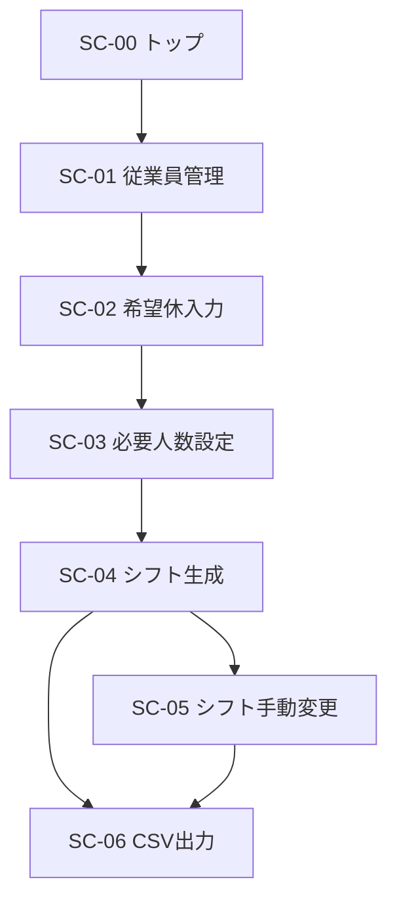

# シフト自動作成デモ 画面設計書

## 1. 文書情報

| 項目           | 内容                          |
| -------------- | ----------------------------- |
| 文書名         | シフト自動作成デモ 画面設計書 |
| ファイル名     | `06_screen_design.md`         |
| 対象システム   | `shift-scheduler`             |
| 対象バージョン | v1.0.0                        |
| 作成日         | 2026-08-02                    |

---

## 2. 本書の目的

本書は、シフト自動作成デモにおける各画面の目的、表示項目、入力項目、操作、入力チェック、状態遷移を定義する。

利用者向けの具体的な操作手順は`07_user_guide.md`に記載する。

システム内部の構成は`03_system_design.md`、機能要件は`02_requirements.md`に記載する。

---

## 3. 画面設計方針

本システムの画面は、次の方針で設計する。

- Streamlitのマルチページ機能を使用する
- 左側のサイドバーから各機能へ移動する
- 1画面につき1つの主要業務を担当する
- 対象月を扱う画面では、年と月の選択方式を統一する
- 成功、警告、エラーを視覚的に区別する
- データが存在しない場合は、次に行う操作を案内する
- DB更新前に入力値を検証する
- 保存後は再描画し、Flashメッセージを表示する
- 表形式が適しているデータはDataFrameで表示する
- 破壊的な操作や上書き操作には注意文または確認欄を設ける

---

## 4. 画面一覧

| 画面ID | 画面名         | ファイル                    | 主な目的                       |
| ------ | -------------- | --------------------------- | ------------------------------ |
| SC-00  | トップ         | `app.py`                    | システム概要と操作順の案内     |
| SC-01  | 従業員管理     | `pages/1_従業員管理.py`     | 従業員の登録・編集・状態変更   |
| SC-02  | 希望休入力     | `pages/2_希望休入力.py`     | 希望休の登録・一覧・削除       |
| SC-03  | 必要人数設定   | `pages/3_必要人数設定.py`   | 日付・シフトごとの必要人数設定 |
| SC-04  | シフト生成     | `pages/4_シフト生成.py`     | 入力検証と月間シフト自動生成   |
| SC-05  | シフト手動変更 | `pages/5_シフト手動変更.py` | 保存済みシフトの変更・再検証   |
| SC-06  | CSV出力        | `pages/6_CSV出力.py`        | 保存済みシフトのCSV出力        |

---

## 5. 画面遷移

Streamlitのサイドバーから、各画面へ直接移動できる。

ただし、基本的な利用順序は次のとおりである。



各ページは直接開かれる可能性があるため、ページ開始時にDB初期化を行う。

---

## 6. 共通UI

### 6.1 ページ構成

各画面は、原則として次の順に構成する。

1. ページタイトル
2. 画面の説明
3. Flashメッセージ
4. 対象月などの主要条件
5. 状況・集計値
6. 入力・操作領域
7. 一覧・結果表示
8. 注意・エラー表示

---

### 6.2 対象年月選択

対象月を扱う画面では、共通関数`select_target_month()`を使用する。

対象画面：

- 希望休入力
- 必要人数設定
- シフト生成
- シフト手動変更
- CSV出力

返却値：

- 選択年
- 選択月
- `YYYY-MM`形式の対象月

画面ごとに異なる`key_prefix`を使用し、ウィジェットキーの衝突を防止する。

---

### 6.3 Flashメッセージ

登録・更新・削除後に再描画する場合、処理結果をsession stateへ一時保存する。

再描画後に次の形式で表示する。

| レベル    | 表示             |
| --------- | ---------------- |
| `success` | 成功メッセージ   |
| `info`    | 情報メッセージ   |
| `warning` | 警告メッセージ   |
| `error`   | エラーメッセージ |

表示後はsession stateから削除する。

---

### 6.4 検証結果表示

検証結果は`ValidationIssue`の一覧として受け取る。

表示内容：

- エラー件数
- 警告件数
- ルールID
- 対象日
- シフト
- 従業員ID
- メッセージ

エラーと警告を区別し、問題がない場合は正常メッセージを表示する。

---

## 7. SC-00 トップ画面

### 7.1 目的

アプリの目的、主な機能、基本的な操作順を利用者へ案内する。

### 7.2 表示内容

- アプリ名
- アプリの概要
- 主な機能
- 基本的な操作順
- シフト生成で考慮する条件
- 現在の対象範囲

### 7.3 入力・操作

トップ画面内には、データを更新する入力フォームを設けない。

各機能への移動は、Streamlitのサイドバーを使用する。

### 7.4 初期処理

画面表示時に`init_db()`を実行し、必要なテーブルを作成する。

---

## 8. SC-01 従業員管理画面

### 8.1 目的

シフト生成に使用する従業員情報を登録・編集し、有効状態を管理する。

### 8.2 画面構成

1. 従業員数の集計
2. 従業員一覧
3. 新規登録
4. 編集・状態変更

---

### 8.3 集計表示

画面上部に、次の3指標を表示する。

| 項目         | 内容                         |
| ------------ | ---------------------------- |
| 登録従業員数 | 有効・無効を含む全従業員数   |
| 有効従業員数 | `is_active=True`の従業員数   |
| 有効責任者数 | 有効かつ責任者である従業員数 |

---

### 8.4 従業員一覧

#### 表示列

| 列           | 内容             |
| ------------ | ---------------- |
| 従業員ID     | 従業員の識別子   |
| 氏名         | 従業員名         |
| 責任者       | 責任者区分       |
| 契約勤務日数 | 月間契約勤務日数 |
| 早番         | 早番勤務可否     |
| 遅番         | 遅番勤務可否     |
| 状態         | 有効・無効       |

従業員が0件の場合は、未登録であることを案内する。

---

### 8.5 新規登録フォーム

#### 入力項目

| 項目             | UI               | 初期値・範囲    |
| ---------------- | ---------------- | --------------- |
| 従業員ID         | テキスト入力     | 最大30文字      |
| 氏名             | テキスト入力     | 最大50文字      |
| 月間契約勤務日数 | 数値入力         | 0〜31、初期値20 |
| 責任者として扱う | チェックボックス | 未選択          |
| 早番勤務可能     | チェックボックス | 選択            |
| 遅番勤務可能     | チェックボックス | 選択            |

#### 実行ボタン

```text
従業員を登録
```

#### 入力チェック

- 従業員IDが空でない
- 従業員IDが未登録である
- 氏名が空でない
- 契約勤務日数が0〜31である
- 早番または遅番の少なくとも一方が勤務可能である

#### 成功時

- 従業員を登録する
- Flashメッセージを設定する
- 画面を再描画する
- フォームをクリアする

#### 失敗時

フォーム直下にエラーメッセージを表示する。

---

### 8.6 編集フォーム

#### 編集対象

全従業員から、次の表示形式で選択する。

```text
従業員ID｜氏名｜有効状態
```

#### 編集項目

- 氏名
- 月間契約勤務日数
- 責任者区分
- 早番勤務可否
- 遅番勤務可否

従業員IDは表示するが、編集不可とする。

#### 実行ボタン

```text
変更を保存
```

入力条件は新規登録と同様とする。

---

### 8.7 有効状態変更

#### 有効な従業員

次の注意を表示する。

```text
無効化すると、以後の自動生成対象から除外されます。
既存シフトは自動では削除されません。
```

実行ボタン：

```text
この従業員を無効化
```

#### 無効な従業員

実行ボタン：

```text
この従業員を再有効化
```

#### 処理後

成功・失敗に応じたFlashメッセージを表示し、画面を再描画する。

---

## 9. SC-02 希望休入力画面

### 9.1 目的

対象月の従業員別希望休を登録・確認・削除する。

### 9.2 画面構成

1. 対象年月選択
2. 状況集計
3. 希望休登録
4. 登録済み希望休一覧
5. 希望休削除

---

### 9.3 集計表示

| 項目             | 内容                            |
| ---------------- | ------------------------------- |
| 有効従業員数     | 対象となる有効従業員数          |
| 希望休登録件数   | 対象月の希望休総数              |
| 登録済み従業員数 | 希望休を1件以上登録した従業員数 |

---

### 9.4 希望休登録フォーム

#### 入力項目

| 項目         | UI               | 内容           |
| ------------ | ---------------- | -------------- |
| 従業員       | セレクトボックス | 有効従業員のみ |
| 希望休の日付 | 日付入力         | 対象月内に制限 |

従業員の表示形式：

```text
従業員ID｜氏名
```

#### 実行ボタン

```text
希望休を登録
```

#### 入力チェック

- 有効な従業員である
- 日付が対象月内である
- 同一従業員・同一日付が未登録である

### 有効従業員が0件の場合

登録フォームを表示せず、警告を表示する。

---

### 9.5 登録済み希望休一覧

#### 絞り込み

次の条件から選択する。

- すべて
- 個別の従業員

無効な従業員も、過去の登録内容を確認できるよう絞り込み対象に含める。

#### 表示列

| 列       | 内容       |
| -------- | ---------- |
| 日付     | 希望日     |
| 曜日     | 曜日       |
| 従業員ID | 従業員ID   |
| 氏名     | 従業員名   |
| 状態     | 有効・無効 |

対象月に希望休がない場合は、未登録であることを表示する。

---

### 9.6 希望休削除

削除対象は次の形式で選択する。

```text
日付｜従業員ID｜氏名
```

実行ボタン：

```text
選択した希望休を削除
```

削除成功後はFlashメッセージを表示し、画面を再描画する。

---

## 10. SC-03 必要人数設定画面

### 10.1 目的

対象月の日付・シフトごとに必要人数と必要責任者数を設定する。

### 10.2 画面構成

1. 対象年月選択
2. 一括設定
3. 日付・シフト別設定
4. 月間集計
5. 保存・復元操作

---

### 10.3 一括設定

#### 入力項目

| 項目                   |  範囲 | 初期値 |
| ---------------------- | ----: | -----: |
| 全シフトの必要人数     | 0〜20 |      2 |
| 全シフトの必要責任者数 | 0〜20 |      1 |

#### 実行ボタン

```text
表全体に一括反映
```

#### 入力チェック

必要責任者数が必要人数を超える場合は、反映せずエラーを表示する。

#### 反映方法

一括設定値はsession stateへ保存し、対象月の全日・全シフトへ一時反映する。

この時点ではDBへ保存しない。

---

### 10.4 日付・シフト別設定

`st.data_editor`を使用し、対象月の全日について早番・遅番の行を表示する。

#### 表示・編集列

| 列           | 編集   | 内容            |
| ------------ | ------ | --------------- |
| 日付         | 不可   | 対象日          |
| 曜日         | 不可   | 曜日            |
| シフト       | 不可   | 早番・遅番      |
| シフトコード | 非表示 | `early`・`late` |
| 必要人数     | 可     | 0〜20           |
| 必要責任者数 | 可     | 0〜20           |

行追加・削除は不可とする。

---

### 10.5 行単位の入力チェック

次の場合はエラーとする。

```text
必要責任者数 > 必要人数
```

該当件数を画面に表示し、保存ボタンを無効化する。

---

### 10.6 月間集計

| 項目            | 内容                   |
| --------------- | ---------------------- |
| 月間必要勤務枠  | 全行の必要人数合計     |
| 月間責任者枠    | 全行の必要責任者数合計 |
| 1シフト最大人数 | 必要人数の最大値       |

---

### 10.7 保存操作

実行ボタン：

```text
必要人数設定を保存
```

#### 成功時

- DataFrameを`StaffingRequirement`へ変換する
- 対象月の設定を保存する
- 一時的な一括設定値とエディター状態を削除する
- Flashメッセージを表示する
- 画面を再描画する

#### 失敗時

エラーメッセージを表示する。

---

### 10.8 復元操作

実行ボタン：

```text
保存済みの内容に戻す
```

一時的な一括設定値と編集中データを破棄し、DBに保存されている内容を再表示する。

DBの内容は変更しない。

---

## 11. SC-04 シフト生成画面

### 11.1 目的

対象月の入力データを検証し、OR-Toolsを使用して月間シフトを自動生成する。

### 11.2 画面構成

1. 対象年月選択
2. 入力データ状況
3. 生成前チェック
4. 自動生成設定
5. 生成結果
6. 月間シフト
7. 配置明細
8. 保存済みシフトの検証
9. 従業員別勤務集計

---

### 11.3 対象月表示

選択した対象月を次の形式で表示する。

```text
生成対象：YYYY年M月
```

---

### 11.4 入力データ状況

| 項目         | 内容                         |
| ------------ | ---------------------------- |
| 有効従業員   | 有効従業員数                 |
| 有効責任者   | 有効かつ責任者である従業員数 |
| 希望休       | 対象月の希望休件数           |
| 必要人数設定 | 登録件数 / 必要件数          |

必要人数設定の必要件数は次のとおりとする。

```text
対象月の日数 × 2シフト
```

不足している場合は、必要人数設定画面で保存するよう警告する。

---

### 11.5 生成前チェック

`validate_month_generation_inputs()`を実行し、検証結果を表示する。

主な検証項目：

- 有効従業員
- 有効責任者
- 必要人数設定の完全性
- 配置可能従業員数
- 配置可能責任者数
- 契約勤務日数合計
- 週5日上限を考慮した配置能力

エラーがある場合は自動生成ボタンを無効化する。

---

### 11.6 探索時間

次の選択肢からSolverの探索時間上限を選択する。

- 3秒
- 5秒
- 10秒
- 30秒

初期値は10秒とする。

---

### 11.7 既存シフトの上書き確認

対象月に保存済みシフトが存在する場合、次を表示する。

- 保存済み配置件数
- 再生成すると現在のシフトが置き換わる旨の警告
- 上書き確認チェックボックス

確認項目：

```text
既存シフトを置き換えることを確認しました
```

確認されるまで生成ボタンを無効化する。

---

### 11.8 自動生成

実行ボタン：

```text
シフトを自動生成
```

#### 無効化条件

- 生成前検証にエラーがある
- 既存シフトの上書きが未確認
- 生成処理を実行中である

#### 実行中

スピナーを表示する。

```text
シフトを生成しています...
```

二重実行を防止するため、対象月単位の実行中フラグをsession stateへ保持する。

---

### 11.9 生成結果

#### 成功

```text
シフトを生成し、データベースへ保存しました。
```

#### 失敗

```text
シフトを生成できませんでした。
```

#### 表示指標

| 項目             | 内容                         |
| ---------------- | ---------------------------- |
| Solver結果       | 最適解、実行可能解、解なし等 |
| 最大契約日数乖離 | 最も大きい契約勤務日数との差 |
| 乖離合計         | 全従業員の差の合計           |

#### Solver状態別表示

| 状態            | 表示                           |
| --------------- | ------------------------------ |
| `OPTIMAL`       | 最適解                         |
| `FEASIBLE`      | 実行可能解。最適性未証明の案内 |
| `INFEASIBLE`    | すべての制約を満たす解がない   |
| `MODEL_INVALID` | モデル不正                     |
| `UNKNOWN`       | 探索時間内に結果未確定         |

生成時の検証結果もあわせて表示する。

---

### 11.10 月間シフト

#### 表示列

| 列   | 内容       |
| ---- | ---------- |
| 日付 | 対象日     |
| 曜日 | 曜日       |
| 早番 | 早番配置者 |
| 遅番 | 遅番配置者 |

保存済みシフトがない場合は、未生成であることを表示する。

---

### 11.11 配置明細

保存済みシフトがある場合、折りたたみ領域に配置明細を表示する。

主な列：

- 日付
- 曜日
- シフト
- 従業員ID
- 氏名
- 責任者
- 手動変更

---

### 11.12 保存済みシフトの検証

保存済みシフトについて`validate_month_schedule()`を実行する。

問題がない場合：

```text
保存済みシフトはすべての検証を通過しています。
```

保存済みシフトがない場合は、検証対象がないことを表示する。

---

### 11.13 従業員別勤務集計

#### 表示項目

- 従業員ID
- 氏名
- 契約勤務日数
- 割当勤務日数
- 差
- 早番回数
- 遅番回数
- 最大連続勤務日数
- 責任者配置回数

#### 集計指標

| 項目         | 内容                       |
| ------------ | -------------------------- |
| 配置件数     | 保存済み配置の件数         |
| 勤務日数合計 | 全従業員の割当勤務日数合計 |
| 最大連続勤務 | 対象月内の最大連続勤務日数 |

---

## 12. SC-05 シフト手動変更画面

### 12.1 目的

保存済みシフトを手動で調整し、月間シフト全体を再検証して保存する。

### 12.2 前提条件

対象月に保存済みシフトが必要である。

存在しない場合は、シフト生成画面で先に生成するよう案内し、以降の表示を停止する。

---

### 12.3 画面構成

1. 対象年月選択
2. 編集中のシフト
3. 配置変更フォーム
4. 現在の配置
5. 編集案の検証
6. 変更内容
7. 保存・破棄

---

### 12.4 編集案の状態管理

対象月ごとに次をsession stateへ保持する。

| データ | 用途               |
| ------ | ------------------ |
| 原本   | 変更前後の差分比較 |
| 編集案 | 現在の変更内容     |

キーには対象月を含める。

```text
manual_schedule_original_YYYY-MM
manual_schedule_draft_YYYY-MM
```

---

### 12.5 編集中のシフト

月間シフト表を表示する。

手動変更された配置者には`※`を付ける。

説明：

```text
※は手動変更された配置です。
```

---

### 12.6 配置変更フォーム

#### 入力項目

| 項目   | UI               | 内容             |
| ------ | ---------------- | ---------------- |
| 変更日 | 日付入力         | 対象月内         |
| 従業員 | セレクトボックス | 有効従業員       |
| 変更後 | セレクトボックス | 早番・遅番・休み |

#### 実行ボタン

```text
編集案へ反映
```

#### 動作

- 早番を選択：対象日の配置を早番へ変更
- 遅番を選択：対象日の配置を遅番へ変更
- 休みを選択：対象日の配置を削除

変更は編集案へ反映し、この時点ではDBへ保存しない。

---

### 12.7 現在の配置

選択中の従業員・日付について、現在の編集案上の配置を表示する。

表示値：

- 早番
- 遅番
- 休み

---

### 12.8 編集案の検証

編集案全体を`validate_manual_schedule()`で検証する。

主な検証：

- 必要人数
- 必要責任者数
- 希望休
- 勤務可能シフト
- 1日1シフト
- 週5日
- 最大5連勤
- 有効従業員

検証結果にエラーがある場合、保存ボタンを無効化する。

警告のみの場合は保存できる。

---

### 12.9 変更内容

原本と編集案を比較して、差分表を表示する。

表示項目：

- 日付
- 曜日
- 従業員ID
- 氏名
- 変更前
- 変更後

変更がない場合は、未変更であることを表示する。

---

### 12.10 保存

実行ボタン：

```text
手動変更を保存
```

#### 有効化条件

- 変更が1件以上ある
- 編集案にエラーがない

#### 成功時

- 対象月のシフトを編集案で一括置換する
- 原本と編集案をsession stateから削除する
- Flashメッセージを設定する
- 画面を再描画する

---

### 12.11 編集案の破棄

実行ボタン：

```text
編集案を破棄
```

変更がない場合は無効化する。

実行時：

- 原本をsession stateから削除する
- 編集案をsession stateから削除する
- DBは変更しない
- 保存済みシフトを再読込する
- 情報メッセージを表示する

---

## 13. SC-06 CSV出力画面

### 13.1 目的

保存済みの月間シフトと勤務集計をCSV形式でダウンロードする。

### 13.2 前提条件

対象月に保存済みシフトが必要である。

存在しない場合は、シフト生成画面で先に生成するよう案内し、以降の表示を停止する。

---

### 13.3 出力可能件数

対象月と配置件数を表示する。

例：

```text
2026年8月の124件の配置を出力できます。
```

---

### 13.4 月間シフト表

#### 説明

日付ごとの早番・遅番を横並びで表示する。

手動変更された配置者には`※`を付ける。

#### 出力列

- 日付
- 曜日
- 早番
- 遅番

#### ダウンロードボタン

```text
月間シフト表をダウンロード
```

#### ファイル名

```text
shift_monthly_YYYYMM.csv
```

---

### 13.5 配置明細

#### 説明

1件の配置を1行として表示する。

#### 出力列

- 日付
- 曜日
- シフト
- 従業員ID
- 氏名
- 責任者
- 手動変更

#### ダウンロードボタン

```text
配置明細をダウンロード
```

#### ファイル名

```text
shift_detail_YYYYMM.csv
```

---

### 13.6 従業員別勤務集計

#### 説明

従業員単位の勤務状況を表示する。

#### 出力列

- 従業員ID
- 氏名
- 契約勤務日数
- 割当勤務日数
- 差
- 早番回数
- 遅番回数
- 最大連続勤務日数
- 責任者配置回数

#### ダウンロードボタン

```text
勤務集計をダウンロード
```

#### ファイル名

```text
shift_summary_YYYYMM.csv
```

---

### 13.7 CSV形式

- 文字コード：UTF-8 BOM付き
- 区切り文字：カンマ
- 改行：LF
- インデックス列：出力しない
- MIMEタイプ：`text/csv`

---

## 14. エラー・空データ時の表示

| 状況                     | 画面の動作              |
| ------------------------ | ----------------------- |
| 従業員が未登録           | 登録を促す情報表示      |
| 有効従業員がいない       | 希望休登録を停止        |
| 希望休がない             | 未登録であることを表示  |
| 必要人数設定値が不正     | 保存ボタンを無効化      |
| 生成前検証エラー         | 自動生成ボタンを無効化  |
| 保存済みシフトがない     | 手動変更・CSV出力を停止 |
| 手動変更に制約違反がある | 保存ボタンを無効化      |
| CSV対象データがない      | 生成画面への案内を表示  |

---

## 15. 破壊的操作・上書き操作

| 操作               | 対応                       |
| ------------------ | -------------------------- |
| 従業員無効化       | 影響を警告                 |
| 希望休削除         | 削除対象を選択して実行     |
| シフト再生成       | 上書き確認チェックを要求   |
| 必要人数の編集破棄 | 保存済み内容に戻すボタン   |
| 手動変更の破棄     | 編集案を破棄するボタン     |
| 月間シフト保存     | トランザクションで一括置換 |

---

## 16. 使用モジュール対応

| 画面           | 主なサービス・補助モジュール                     |
| -------------- | ------------------------------------------------ |
| 従業員管理     | `employee_service.py`                            |
| 希望休入力     | `day_off_service.py`                             |
| 必要人数設定   | `staffing_service.py`                            |
| シフト生成     | `schedule_service.py`、`schedule_view.py`        |
| シフト手動変更 | `manual_schedule_service.py`、`schedule_view.py` |
| CSV出力        | `export_service.py`                              |
| 共通           | `ui_helpers.py`、`repositories.py`               |

---

## 17. 現在の制約

- ログイン画面はない
- 利用者別の権限表示はない
- 複数事業所の切替はない
- 画面間で対象月を完全には共有しない
- 生成履歴一覧画面はない
- 手動変更履歴画面はない
- データ初期化画面はない
- CSV以外の出力形式はない
- モバイル専用レイアウトはない

---

## 18. 関連文書

| 文書                         | 内容               |
| ---------------------------- | ------------------ |
| `01_overview.md`             | 背景と対象業務     |
| `02_requirements.md`         | 機能・非機能要件   |
| `03_system_design.md`        | システム構成       |
| `04_data_definition.md`      | DBとモデル         |
| `05_schedule_constraints.md` | シフト制約と最適化 |
| `07_user_guide.md`           | 利用者向け操作手順 |
| `08_test_plan.md`            | テスト計画         |
| `09_test_report.md`          | テスト結果         |
