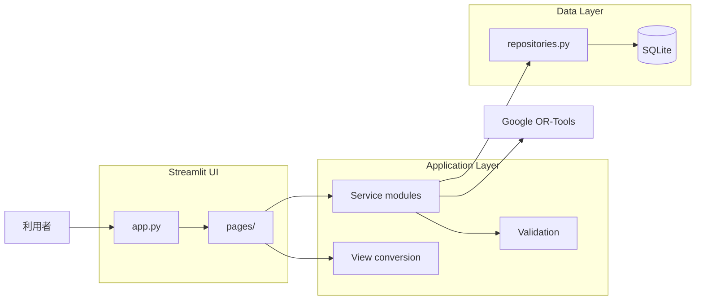

# アーキテクチャ

## データアクセス層

`src/repositories.py`は、SQLiteに対するデータ操作を担当する。

主な責務は以下のとおり。

- 従業員情報の登録・取得・更新
- 希望休の登録・取得・削除
- 必要人数の登録・取得
- シフト生成履歴の登録
- シフト配置の登録・取得・削除・一括置換
- DBレコードとデータモデルの変換

画面やサービス層からSQLを直接実行しない。

業務上の制約判定やシフト最適化は、
リポジトリ層には実装しない。

## 事前検証ルール

| ルールID | 重要度 | 内容                                                     |
| -------- | ------ | -------------------------------------------------------- |
| PV-01    | エラー | 有効な従業員が存在しない                                 |
| PV-02    | エラー | 有効な責任者が存在しない                                 |
| PV-03    | エラー | 対象月の必要人数設定が不足している                       |
| PV-04    | エラー | 日付・シフト別の勤務可能者数が必要人数未満               |
| PV-05    | エラー | 日付・シフト別の責任者候補数が必要責任者数未満           |
| PV-06    | 警告   | 必要勤務枠が契約勤務日数合計を上回る                     |
| PV-07    | 警告   | 契約勤務日数合計が必要勤務枠を上回る                     |
| PV-08    | 警告   | 従業員の契約勤務日数が対象月の日数を上回る               |
| PV-09    | エラー | 必要人数または必要責任者数が不正                         |
| PV-10    | 警告   | 週間上限を考慮すると総勤務可能日数が不足する可能性が高い |

## 入力データ事前検証

`src/validation.py`は、シフト自動生成前の入力データ検証を担当する。

事前検証では以下を確認する。

- 有効な従業員の存在
- 責任者の存在
- 必要人数設定の不足
- 日付・シフト別の勤務可能者不足
- 日付・シフト別の責任者候補不足
- 必要勤務枠と契約勤務日数合計の差
- 週5日上限を考慮した全体配置容量

検証結果は`ValidationIssue`として返す。

事前検証は、最適化問題が必ず解を持つことを保証するものではない。
事前検証で検出できない制約の組み合わせについては、
OR-Toolsによる最適化処理で判定する。

## 生成済みシフト検証

生成済みシフトと手動変更後のシフトは、
共通の`validate_schedule()`関数で検証する。

検証対象は以下のとおり。

- 1日1シフト
- 希望休
- 勤務可能シフト
- 必要人数
- 必要責任者数
- 週5日上限
- 連続勤務5日上限
- 有効従業員

契約勤務日数やシフト区分の偏りは警告として扱う。

自動生成結果はDBへ保存する前に検証し、
ハード制約違反が0件であることを確認する。

手動変更結果も同じ検証処理を使用し、
ハード制約違反がある場合は保存しない。

## シフト最適化

`src/optimizer.py`は、OR-Tools CP-SATを使用して
シフト配置を生成する。

### 配置変数

`work[employee_id, target_date, shift_type]`

- 1：勤務する
- 0：勤務しない

### ハード制約

- 1人1日1シフト以内
- 希望休への配置禁止
- 勤務不可シフトへの配置禁止
- 必要人数との完全一致
- 必要責任者数以上
- 週5日以内
- 連続勤務5日以内
- 無効従業員を対象外とする

### 目的関数

次の順に優先する。

1. 従業員別の契約勤務日数との最大乖離を最小化
2. 全従業員の契約勤務日数との乖離合計を最小化

最大乖離の重みを乖離合計の理論最大値より大きくすることで、
優先順位を表現する。

### 保存前検証

Solverが生成した結果は、
`validate_schedule()`で再検証する。

ハード制約違反が検出された場合はDBへ保存しない。

